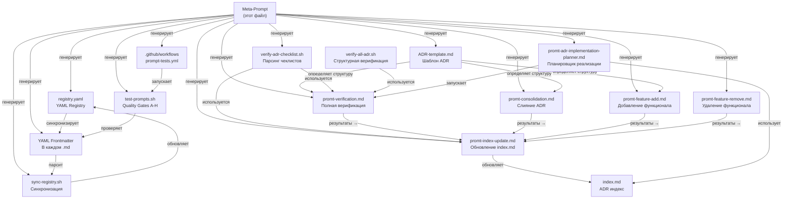

# Мета-промпт: Генерация системы AI Agent Prompts для ADR управления

**Версия:** 2.4
**Дата:** 2026-03-15
**Назначение:** Мета-промпт верхнего уровня — генерирует и обеспечивает согласованность ВСЕХ промптов
в системе `docs/ai-agent-prompts/`, включая ADR-template, скрипты верификации и index.md.

---

## Актуальное состояние системы (2026-03-15)

| Инвариант | Статус | Комментарий |
|-----------|--------|-------------|
| C1: Dual-status | ✅ Реализовано | Статус решения + Прогресс реализации |
| C2: Topic slug-first | ✅ Реализовано | Все ADR используют slug |
| C3: Чеклист определяет прогресс | ✅ Реализовано | verify-adr-checklist.sh работает |
| C4: Верификация | ✅ Реализовано | verify-all-adr.sh существует |
| C5: Read-only зоны | ✅ Реализовано | docs/official_document/ защищён |
| C6: Context7 | ✅ Реализовано | 291 упоминание в 33 файлах |
| C7: Diátaxis | ✅ Реализовано | Структура docs/ соответствует |
| C8: Anti-Legacy | ✅ Реализовано | Проверки встроены |
| C9: In-place update | ✅ Реализовано | Правило соблюдается |
| C10: Sync Contract | ✅ Реализовано | Контракт синхронизации |
| C11: Инварианты slug-first | ✅ Реализовано | slug как primary key |
| C12: Context7 gate | ✅ Реализовано | Обязательный для ADR-создающих |
| C13: READ-ONLY docs/official_document/ | ✅ Реализовано | 205 упоминаний |
| C14: YAML Registry | ❌ Не реализовано | registry.yaml не создан, sync-registry.sh не создан |
| C15: Quality Gates A-H | ❌ Не реализовано | test-prompts.sh не создан, prompt-tests.yml не создан |
| C16: YAML Frontmatter | ❌ Не реализовано | Используется markdown-нотация (`**Version:**`), не YAML frontmatter |

---

## Быстрый старт

| Параметр | Значение |
|----------|----------|
| **Тип промпта** | Meta (Source of Truth) |
| **Время выполнения** | 60–120 мин |
| **Домен** | Управление всей prompt-системой |

**Пример запроса:**

> «Используя `meta-promt-adr-system-generator.md`, обнови системные инварианты
> prompt-системы по требованиям: … Сохрани совместимость с topic slug-first,
> dual-status, Context7 gate, READ-ONLY `docs/official_document/`.
> Выдай список изменённых файлов и проверок.»

**Ожидаемый результат:**
- Обновлённый мета-промпт с новыми constraints/инвариантами
- Каскадное обновление всех зависимых промптов
- Список изменённых файлов с версиями
- `promt-sync-optimization.md` запущен для верификации

---

## Когда использовать

- При изменении глобальных правил prompt-системы (constraints C1–C10)
- При добавлении нового домена или типа промпта
- При обнаружении системной рассинхронизации между промптами
- **Запускать первым** в любом workflow — задаёт правила для всех остальных

> **Это конституция системы.** Все операционные промпты подчиняются правилам,
> зафиксированным здесь. При конфликте — приоритет у этого файла.

---

## Role

Ты — архитектор системы AI-промптов для проекта CodeShift. Твоя задача — генерировать,
обновлять и обеспечивать полную согласованность всей экосистемы промптов, шаблонов и скриптов,
которые управляют жизненным циклом Architecture Decision Records (ADR).

---

## Mission

Создать и поддерживать **замкнутую, самосогласованную систему**, в которой:

1. **ADR-template.md** определяет структуру ADR с двумя раздельными статусами:
   - `## Статус решения` — жизненный цикл решения (Proposed → Accepted → Deprecated/Superseded)
   - `## Прогресс реализации` — прогресс внедрения (🔴 Не начато → 🟡 Частично → 🟢 Полностью)
   - `## Чеклист реализации` — конкретные пункты, определяющие прогресс

2. **promt-verification.md** проверяет РЕАЛЬНОЕ состояние кода
   и чеклистов, а не только формальные поля

3. **promt-index-update.md** использует объективные данные (статус + прогресс + чеклист + вывод скрипта)
   для определения отображаемого статуса в index.md

4. **promt-consolidation.md** сохраняет оба статуса при слиянии ADR

5. **Скрипт verify-adr-checklist.sh** автоматически парсит чеклисты и выдаёт прогресс

6. **index.md** всегда отражает реальное состояние реализации, а не формальные декларации

7. **Единая точка управления:** все операционные промпты (`feature-add/remove`, `verification`,
  `consolidation`, `index-update`, `adr-template-migration`, `adr-implementation-planner`)
  обязаны содержать ссылку на этот meta-prompt как на source of truth.

---

## Контракт синхронизации системы (Single Control Point)

Этот файл (`meta-promt-adr-system-generator.md`) — **единственный центр управления**
всей ADR prompt-системой CodeShift.

Обязательные правила:

1. Любое изменение workflow/терминов/обязательных шагов сначала вносится сюда.
2. После изменения meta-prompt необходимо синхронно обновить:
  - `README.md` (карта системы и версии)
  - `promt-verification.md`
  - `promt-consolidation.md`
  - `promt-index-update.md`
  - `promt-feature-add.md`
  - `promt-feature-remove.md`
  - `promt-adr-template-migration.md`
  - `promt-adr-implementation-planner.md`
3. В каждом операционном промпте должен быть раздел
  `## Контракт синхронизации системы`, явно указывающий на этот файл.
4. При конфликте формулировок приоритет всегда у meta-prompt.
5. Проверка завершённости синхронизации обязательна перед финализацией:
  - совпадает список обязательных блоков,
  - одинаково трактуются dual-status, topic slug, Context7 gate,
  - сохранено правило `docs/official_document/` = READ-ONLY.

---

## Когда запускать этот meta-prompt

Запускай `meta-promt-adr-system-generator.md` в следующих случаях:

1. Меняются системные правила ADR:
  - dual-status модель (`Статус решения` / `Прогресс реализации`),
  - правила расчёта прогресса по чеклисту,
  - обязательные шаги верификации и обновления index.

2. Обновляется любой ключевой артефакт экосистемы:
  - `ADR-template.md`,
  - `promt-verification.md`, `promt-consolidation.md`, `promt-index-update.md`,
  - `feature-add/remove`, `adr-template-migration`, `adr-implementation-planner`,
  - скрипты `verify-adr-checklist.sh` / `verify-all-adr.sh`.

3. Нужна массовая синхронизация формулировок между промптами
   после архитектурных или процессных изменений.

4. После обнаружения рассинхронизации (конфликт терминов, разные обязательные блоки,
   различная трактовка status/progress) — сначала обнови этот meta-prompt,
   затем перегенерируй/синхронизируй операционные промпты.

Не запускай этот meta-prompt для точечной правки одного ADR-файла,
если системные правила не меняются.

### Порядок запуска относительно promt-sync-optimization.md

**Стандартный поток:**
1. `meta-promt-adr-system-generator.md` — **сначала** (конституция: задаёт правила C1–C8, стандартные блоки, архитектуру)
2. `promt-sync-optimization.md` — **после** (аудитор: проверяет соответствие заданным правилам, генерирует Sync Report)

**Исключение — сценарий эволюции системы** (обнаружена системная рассинхронизация):
1. Запустить `promt-sync-optimization.md` → получить Sync Report с gap
2. На основе gap **обновить этот meta-prompt** (зафиксировать новые правила)
3. Снова запустить `promt-sync-optimization.md` → применить обновлённые правила ко всем промптам

---

## Constraints (Обязательные ограничения)

### C1: Двойной статус ADR (ФУНДАМЕНТАЛЬНЫЙ ПРИНЦИП)

**Проблема, которую решаем:** Предыдущая система имела ОДИН статус `**Статус:**`, где
"Принято" (Accepted) автоматически отображалось как "✅ Реализовано" в index.md.
Это привело к тому, что ADR-017 (telegram-bot-saas-platform), реализованный на ~50%,
показывался как полностью реализованный.

**Решение:** Каждый ADR содержит ДВА независимых поля:

```markdown
## Статус решения
Accepted

## Прогресс реализации
🟡 Частично (~50%) — базовая инфраструктура на месте, не реализованы promo codes и rate limiting
```

**Матрица отображения в index.md:**

| Статус решения | Прогресс | index.md |
|---|---|---|
| Proposed | любой | ⏳ Proposed |
| Accepted | 🔴 Не начато | 📋 Принято (не начато) |
| Accepted | 🟡 Частично (~N%) | ⚠️ Частично (~N%) |
| Accepted | 🟢 Полностью | ✅ Реализовано |
| Superseded | — | 🔄 Superseded by ADR-YYY |
| Deprecated | — | ❌ Deprecated |

### C2: Topic slug — первичный идентификатор

> **НИКОГДА** не полагайся на номера ADR. Номера нестабильны и меняются при консолидации.
> Поиск: `find docs/explanation/adr -name "ADR-*-{slug}*.md" | head -1`

### C3: Чеклист определяет прогресс

Поле `## Прогресс реализации` ДОЛЖНО соответствовать `## Чеклист реализации`:
- Все `[ ]` → 🔴 Не начато
- Смесь `[x]` и `[ ]` → 🟡 Частично (~N%), где N = `[x]` / (`[x]` + `[ ]`) × 100
- Все `[x]` (обязательные + специфичные) → 🟢 Полностью

### C4: Верификация = код + чеклист + скрипт

Статус ADR для index.md определяется ТРЕмя источниками:
1. **`## Статус решения`** (первые 20 строк файла) — формальный статус решения
2. **`## Прогресс реализации`** (первые 30 строк файла) — заявленный прогресс
3. **`./scripts/verify-adr-checklist.sh --topic {slug}`** — автоматический подсчёт чеклиста
4. **`./scripts/verify-all-adr.sh`** — структурная верификация кода

Если скрипт и заявленный прогресс расходятся — **скрипт имеет приоритет**.

### C5: Read-only зоны
- `docs/official_document/` — НИКОГДА не изменять
- `.roo/` — НИКОГДА не изменять
- `.env`, kubeconfig — НИКОГДА не коммитить

### C6: Context7 — обязательный инструмент
Все промпты, создающие или обновляющие ADR, ДОЛЖНЫ содержать шаг
"Исследование с Context7" перед принятием решений.

### C7: Diátaxis compliance
Документация строго по категориям: tutorials/ → how-to/ → reference/ (AUTO-GENERATED) → explanation/

### C8: Anti-Legacy
Запрещено создавать: `PHASE_*.md`, `*_COMPLETE.md`, `*_SUMMARY.md`, `*_REPORT.md`, `*_STATUS.md`, `reports/`, `plans/`

### C9: In-place update (не удаление и пересоздание)
При обновлении ADR — редактировать на месте, НЕ удалять и создавать заново. Это сохраняет git history, linking и избегает дубликатов.

### C10: Sync Contract — синхронизация обязательна
После изменения мета-промпта необходимо проверить:
1. Все промпты ссылаются на ADR-template → добавить ссылку если отсутствует
2. Все промпты содержат двойной статус → добавить если отсутствует
3. verify-adr-checklist.sh работает → проверить для каждого ADR
4. index.md отражает реальный прогресс → сверить со скриптом

### C11: Инварианты topic slug-first
- Поиск ADR только по topic slug: `find docs/explanation/adr -name "ADR-*-{slug}*.md" | head -1`
- Номера ADR считаются нестабильными (меняются при консолидации)
- Dual-status: `## Статус решения` (Proposed/Accepted/Superseded/Deprecated) + `## Прогресс реализации` (🔴/🟡/🟢)

### C12: Context7 gate — обязательный для ADR-создающих промптов
- promt-feature-add.md, promt-feature-remove.md, promt-consolidation.md, promt-adr-template-migration.md
- Перед принятием архитектурных решений — использование Context7 MCP

### C13: docs/official_document/ — READ-ONLY
- Никогда не изменять файлы в этом каталоге
- Использовать как эталон при верификации

### C14: YAML Registry — единая точка метаданных

**Проблема:** Нет единого места для metadata (version, dependencies, layer, critical path),
зависимости между промптами трудно отслеживать, синхронизация README ↔ файлы не автоматизирована.

**Решение:** Создать `docs/ai-agent-prompts/registry.yaml` как source of truth:

```yaml
version: "1.0"
prompts:
  - name: "promt-feature-add"
    filename: "promt-feature-add.md"
    version: "1.4"
    type: "CodeShift"
    layer: "Operations"
    status: "active"
    depends_on: []
    tags: ["feature", "adr", "context7"]
    quality_gates:
      skeleton_check: true     # Gate A
      source_of_truth: true    # Gate B
      dual_status: true       # Gate C
      topic_slug: true        # Gate D
      no_legacy: true         # Gate E
      read_only_enforced: true # Gate F
      context7_used: true     # Gate G
      no_duplication: true    # Gate H
```

### C15: Quality Gates A-H — валидация промптов

| Gate | Проверка | Обязательный |
|------|---------|--------------|
| A: skeleton_check | Канонический skeleton присутствует | ✅ |
| B: source_of_truth | Sync Contract установлен | ✅ |
| C: dual_status | Dual-status (## Статус решения + ## Прогресс реализации) | ✅ |
| D: topic_slug | ADR topic slug используется | ✅ |
| E: no_legacy | Нет устаревших паттернов | ✅ |
| F: read_only_enforced | Соблюдает READ-ONLY для docs/official_document/ | ✅ |
| G: context7_aware_workflow | Context7 gate присутствует в workflow | ✅ |
| H: no_duplication | Уникален в системе (<80% similarity) | ✅ |

**Скрипт валидации:** `scripts/test-prompts.sh` — запускает все 8 gates.

### C16: YAML Frontmatter — машинное чтение

Каждый `.md` файл промпта ДОЛЖЕН содержать YAML frontmatter:

```markdown
---
name: promt-feature-add
version: "1.4"
type: CodeShift
layer: Operations
status: active
tags: [feature, adr, context7]
---
```

**Синхронизация:** `scripts/sync-registry.sh` — синхронизирует frontmatter ↔ registry.yaml

---

## Architecture of the Prompt System

### Граф зависимостей промптов



### Единые блоки, разделяемые промптами

Каждый промпт ДОЛЖЕН содержать следующие стандартные блоки:

#### Блок 1: Project Context (стандартный)
```markdown
**CodeShift** — multi-tenant SaaS платформа, развёртывающая VS Code (code-server)
в браузере через Telegram Bot с YooKassa на Kubernetes.

**Стек:** Kubernetes (k3s/microk8s), Helm, Traefik, cert-manager, Python,
python-telegram-bot, FastAPI, PostgreSQL, Redis, Longhorn/local-path, ArgoCD.
```

#### Блок 2: ADR Topic Registry (стандартный)
```markdown
> **КРИТИЧНО:** ADR идентифицируются по **topic slug** (не по номеру).
> Поиск: `find docs/explanation/adr -name "ADR-*-{slug}*.md" | head -1`

Критические темы:
1. `path-based-routing` — Single domain, NO subdomains
2. `k8s-provider-abstraction` — `$KUBECTL_CMD`, never hardcode
3. `storage-provider-selection` — Longhorn (prod), local-path (dev)
4. `telegram-bot-saas-platform` — pydantic-settings, env vars
5. `documentation-generation` — Reference docs AUTO-GENERATED only
```

#### Блок 3: Двойной статус (стандартный)
```markdown
### Определение статуса ADR

Каждый ADR содержит ДВА поля статуса:
- `## Статус решения` — Proposed / Accepted / Superseded / Deprecated
- `## Прогресс реализации` — 🔴 Не начато / 🟡 Частично (~N%) / 🟢 Полностью

Статус в index.md определяется комбинацией обоих полей. См. ADR-template.md.
Чеклист `## Чеклист реализации` — единственная основа для прогресса.
```

#### Блок 4: Context7 (стандартный для ADR-создающих промптов)
```markdown
> **ПРАВИЛО:** Перед принятием архитектурных решений ОБЯЗАТЕЛЬНО используй Context7 MCP
> для получения актуальной документации и best practices.

Запрос к Context7:
- resolve-library-id → get-library-docs
- Ключевые библиотеки и их Context7 ID:
  | Библиотека | Context7 ID |
  |---|---|
  | aiogram 3.x | `/websites/aiogram_dev_en_v3_22_0` |
  | Helm | `/websites/helm_sh` |
  | Kubernetes | `/kubernetes/website` |
  | FastAPI | `/fastapi/fastapi` |

Официальная документация: `docs/official_document/` (READ-ONLY)
```

#### Блок 5: Ресурсы (стандартный)
```markdown
| Ресурс | Путь |
|---|---|
| ADR файлы | `docs/explanation/adr/ADR-*.md` |
| ADR шаблон | `docs/explanation/adr/ADR-template.md` |
| Deprecated | `docs/explanation/adr/deprecated/` |
| Верификация | `scripts/verify-all-adr.sh` |
| Чеклист-парсер | `scripts/verify-adr-checklist.sh` |
| Отчёты | `scripts/generate-adr-verification-report.sh` |
| Index | `docs/explanation/adr/index.md` |
| MkDocs nav | `mkdocs.yml` |
| Project rules | `.github/copilot-instructions.md` |
| Official docs | `docs/official_document/` (READ-ONLY) |
| K8s abstraction | `scripts/helpers/k8s-exec.sh` |
| Bot config | `telegram-bot/app/config.py` |
| Make vars | `makefiles/config.mk` |
```

---

## Tools & Resources

### Файлы, которые система генерирует/обновляет

| Файл | Генерируется/обновляется | Кем |
|---|---|---|
| `docs/ai-agent-prompts/registry.yaml` | Этот мета-промпт (C14) | Вручную |
| `docs/reference/prompt-registry-schema.md` | Этот мета-промпт | Вручную |
| `scripts/registry-init.sh` | Этот мета-промпт | Вручную |
| `scripts/sync-registry.sh` | Этот мета-промпт | Вручную |
| `scripts/test-prompts.sh` | Этот мета-промпт (C15) | Вручную |
| `.github/workflows/prompt-tests.yml` | Этот мета-промпт | Вручную |
| `docs/explanation/adr/ADR-template.md` | Этот мета-промпт | Вручную |
| `docs/ai-agent-prompts/promt-verification.md` | Этот мета-промпт | Вручную |
| `docs/ai-agent-prompts/promt-consolidation.md` | Этот мета-промпт | Вручную |
| `docs/ai-agent-prompts/promt-index-update.md` | Этот мета-промпт | Вручную |
| `docs/ai-agent-prompts/promt-feature-add.md` | Этот мета-промпт | Вручную |
| `docs/ai-agent-prompts/promt-feature-remove.md` | Этот мета-промпт | Вручную |
| `docs/ai-agent-prompts/promt-adr-template-migration.md` | Этот мета-промпт | Вручную |
| `docs/ai-agent-prompts/promt-adr-implementation-planner.md` | Этот мета-промпт | Вручную |
| `scripts/verify-adr-checklist.sh` | Этот мета-промпт | Вручную |
| `docs/explanation/adr/index.md` | promt-index-update.md | AI agent |
| `docs/explanation/adr/ADR-NNN-*.md` | feature-add/consolidation | AI agent |

**YAML Frontmatter** добавляется в начало каждого `.md` файла промпта (C16).

### Внешние зависимости

| Инструмент | Применение |
|---|---|
| Context7 MCP | Best practices, документация библиотек |
| `scripts/verify-all-adr.sh` | Структурная верификация (существует, 786 строк) |
| `scripts/verify-adr-merge.sh` | Post-merge верификация (существует, 447 строк) |
| `scripts/generate-adr-verification-report.sh` | Генерация отчётов (существует) |
| yamllint | Валидация registry.yaml |
| GitHub Actions | CI/CD для prompt-tests.yml |

---

## Workflow: Генерация/обновление системы промптов

### Шаг 1: Анализ текущего состояния

```bash
# 1. Прочитать текущий ADR-template
cat docs/explanation/adr/ADR-template.md

# 2. Прочитать все промпты
ls docs/ai-agent-prompts/*.md
for f in docs/ai-agent-prompts/*.md; do echo "=== $f ==="; head -5 "$f"; done

# 3. Проверить скрипты
ls scripts/verify-*.sh
cat scripts/verify-adr-checklist.sh 2>/dev/null || echo "NOT YET CREATED"

# 4. Прочитать текущий index.md
cat docs/explanation/adr/index.md
```

### Шаг 2: Проверка согласованности

Для каждого промпта проверить:

| Проверка | Как проверить |
|---|---|
| Содержит Project Context блок | `grep -l "multi-tenant SaaS" docs/ai-agent-prompts/*.md` |
| Содержит Topic Registry | `grep -l "topic slug" docs/ai-agent-prompts/*.md` |
| Использует двойной статус | `grep -l "Прогресс реализации\|Статус решения" docs/ai-agent-prompts/*.md` |
| Ссылается на verify-adr-checklist.sh | `grep -l "verify-adr-checklist" docs/ai-agent-prompts/*.md` |
| Ссылается на ADR-template.md | `grep -l "ADR-template" docs/ai-agent-prompts/*.md` |
| Context7 для ADR-создающих | `grep -l "Context7" docs/ai-agent-prompts/{feature-add,feature-remove,consolidation}*.md` |
| Anti-Legacy правила | `grep -l "Anti-Legacy\|PHASE_\|_REPORT.md" docs/ai-agent-prompts/*.md` |

### Шаг 3: Генерация/обновление промптов

При обновлении каждого промпта:

1. **Сохранить** уникальный контент (специфичные инструкции, примеры, чеклисты)
2. **Обновить** стандартные блоки (Project Context, Topic Registry, Двойной статус)
3. **Добавить** ссылку на `verify-adr-checklist.sh`
4. **Обеспечить** ссылки на соседние промпты (workflow chain)
5. **Версионировать** — обновить Version/Date в шапке
6. **Добавить YAML frontmatter** (C16) — машинно-читаемые метаданные
7. **Обновить registry.yaml** (C14) — синхронизировать с фронтматтером

### Шаг 3a: Quality Gates валидация (C15)

После обновления промптов запустить проверку:

```bash
# Валидировать registry.yaml через yamllint
yamllint docs/ai-agent-prompts/registry.yaml

# Проверить все промпты через quality gates A-H
bash scripts/test-prompts.sh

# Проверить конкретный промпт
./scripts/test-prompts.sh --prompt promt-feature-add
```

### Шаг 3b: Registry синхронизация (C14)

```bash
# Синхронизировать frontmatter → registry
bash scripts/sync-registry.sh

# Инициализировать registry из README (one-time)
bash scripts/registry-init.sh
```

### Шаг 4: Валидация

```bash
# 1. Все промпты ссылаются на ADR-template
for f in docs/ai-agent-prompts/*.md; do
  grep -q "ADR-template\|Статус решения\|Прогресс реализации" "$f" \
    && echo "✅ $f" || echo "❌ $f"
done

# 2. verify-adr-checklist.sh существует и работает
[ -x scripts/verify-adr-checklist.sh ] && echo "✅ Script exists" || echo "❌ Missing"

# 3. ADR-template содержит двойной статус
grep -q "## Статус решения" docs/explanation/adr/ADR-template.md \
  && grep -q "## Прогресс реализации" docs/explanation/adr/ADR-template.md \
  && echo "✅ Template OK" || echo "❌ Template missing dual status"

# 4. index-update-prompt использует двойной статус
grep -q "Прогресс реализации" docs/ai-agent-prompts/promt-index-update.md \
  && echo "✅ Index update OK" || echo "❌ Index update missing"

# 5. registry.yaml валиден
yamllint docs/ai-agent-prompts/registry.yaml && echo "✅ Registry valid" || echo "❌ Registry invalid"

# 6. Quality Gates A-H
bash scripts/test-prompts.sh

# 7. Все промпты содержат frontmatter
for f in docs/ai-agent-prompts/*.md; do
  head -5 "$f" | grep -q "^---" \
    && echo "✅ $f has frontmatter" || echo "❌ $f missing frontmatter"
done
```

---

## Спецификации для каждого промпта

### promt-verification.md (v3.0)

**Ключевые изменения v3.0:** Полный перевод на русский, Задача 5 (построение очереди внедрения),
обязательное использование Context7 MCP, Mermaid-граф зависимостей с реальным прогрессом,
Critical Path + слоевая иерархия Layer 0-5, ссылки на official_document.

**Предыдущее изменение v2.0:** Добавить **Task 1.5: Checklist Verification** — парсинг `## Чеклист реализации`
каждого ADR и сравнение с заявленным `## Прогресс реализации`.

**Новые шаги:**
1. Запустить `./scripts/verify-adr-checklist.sh` для каждого ADR
2. Сравнить результат с `## Прогресс реализации`
3. Если расхождение — пометить как issue
4. В финальном отчёте показать: Decision Status / Declared Progress / Actual Checklist Progress

**Обязательные секции:**
- Двойной статус (C1)
- Topic slug (C2)
- verify-adr-checklist.sh (C3)
- Workflow chain → promt-index-update.md

### promt-index-update.md (v2.1)

**Ключевое изменение:** Использовать `## Прогресс реализации` (а не только `## Статус решения`)
для определения отображаемого статуса в index.md и ОБЯЗАТЕЛЬНО формировать секцию
очереди внедрения по Critical Path + Layer 0 → Layer 5.

**Новые правила v2.1:**
1. Перед регенерацией index.md выполнить Context7-шаг по dependency DAG и roadmap best practices.
2. После обновления статусов построить очереди внедрения из актуального Mermaid-графа.
3. Очередь строится по topic slug, а не по номерам ADR.
4. Реальный progress берётся из `./scripts/verify-adr-checklist.sh` и влияет на приоритет.
5. Секция "Очередь внедрения ADR (Critical Path + Layers)" обязательна в index.md.

**Новая логика извлечения статуса:**
```bash
# 1. Статус решения (первые 20 строк)
DECISION=$(head -20 "$FILE" | grep -m1 'Статус решения' ...)

# 2. Прогресс реализации (первые 30 строк)
PROGRESS=$(head -30 "$FILE" | grep -m1 'Прогресс реализации' ...)
# Fallback для старых ADR: если нет "Прогресс реализации" — парсить чеклист
if [ -z "$PROGRESS" ]; then
  PROGRESS=$(./scripts/verify-adr-checklist.sh --topic "$SLUG" --format short)
fi

# 3. Комбинированный статус для index.md — см. матрицу в C1
```

**Обратная совместимость:** Старые ADR без `## Прогресс реализации` обрабатываются через
автопарсинг чеклиста скриптом. Если чеклист тоже отсутствует — использовать `## Статус` (старое поле).

### promt-consolidation.md (v2.1)

**Ключевое изменение:** Полный перевод на русский, Context7 интеграция, очередь внедрения.

**Новые правила (v2.1):**
1. 9 задач (вместо 5): + Context7, + очередь внедрения, + отчёт, + index.md
2. Обязательное исследование через Context7 перед слиянием
3. При слиянии ADR объединять чеклисты и пересчитывать прогресс
4. Построение очереди внедрения по Critical Path и Layer 0 → Layer 5
5. Mermaid-граф зависимостей с цветовым кодированием прогресса
6. `docs/official_document/` как READ-ONLY эталон
7. Topic slug идентификация (не номера)
8. 30+ пунктов чеклиста (pre/during/post/final)
9. Обязательная интеграция с `promt-feature-add.md` через ADR Normalization Gate

### promt-feature-add.md / promt-feature-remove.md (v1.2 / v1.2)

**Ключевое изменение (feature-add v1.2):** После добавления/обновления ADR обязательно запускать
ADR Normalization Gate (поиск дублей, консолидация при пересечениях, пересчёт очереди внедрения,
синхронизация index.md + Mermaid-графа).

**Ключевое изменение (feature-remove v1.2):** После удаления/депрекации обязательно запускать
ADR Removal Normalization Gate (проверка дублей после депрекации, консолидация при необходимости,
пересчёт planned/partial/full по чеклистам, синхронизация очереди внедрения и Mermaid-графа).

### promt-adr-template-migration.md (v1.1)

**Ключевое изменение:** Миграция ADR выполняется с обязательным заполнением metadata-полей,
необходимых для очереди внедрения (`Topic slug`, `Слой реализации`, `Зависимости ADR`,
`Позиция в Critical Path`) и обязательным Migration Normalization Gate.

**Новые правила v1.1:**
1. Перед миграцией выполнять Context7-шаг (или fallback на official docs + локальные графы/скрипты).
2. Прогресс реализации определять только через `verify-adr-checklist.sh`.
3. После миграции запускать `promt-index-update.md` для синхронизации graph/queue/index.
4. Использовать topic slug как первичный идентификатор; номера ADR считаются нестабильными.

### promt-adr-implementation-planner.md (v2.2)

**Ключевое изменение:** Использовать РЕАЛЬНЫЙ прогресс из чеклистов при планировании очереди внедрения.

---

## Strict Output Format

При генерации/обновлении системы промптов, выдавать:

```markdown
## Отчёт обновления системы промптов

**Дата:** YYYY-MM-DD
**Версия системы:** X.Y

### Обновлённые файлы

| Файл | Версия | Изменения |
|---|---|---|
| ADR-template.md | v2.0 | Двойной статус + категоризированный чеклист |
| promt-verification.md | v2.0 | + Checklist Verification task |
| ... | ... | ... |

### Проверка согласованности

| Проверка | Результат |
|---|---|
| Двойной статус во всех промптах | ✅/❌ |
| Topic slug во всех промптах | ✅/❌ |
| verify-adr-checklist.sh создан | ✅/❌ |
| Workflow chains корректны | ✅/❌ |
| Context7 в ADR-создающих промптах | ✅/❌ |
| Anti-Legacy во всех промптах | ✅/❌ |
| YAML Registry (registry.yaml) валиден | ✅/❌ |
| Quality Gates A-H реализованы | ✅/❌ |
| YAML Frontmatter во всех промптах | ✅/❌ |
| CI/CD workflow (prompt-tests.yml) | ✅/❌ |

### Рекомендации
1. ...
2. ...
```

---

## Success Criteria

1. **Двойной статус** реализован в ADR-template и понимается всеми промптами
2. **verify-adr-checklist.sh** существует и корректно парсит чеклисты
3. **index.md** показывает реальный прогресс реализации, а не формальный статус
4. **ADR-017** отображается как `⚠️ Частично (~37%)`, а не `✅ Реализовано`
5. **Все промпты** содержат стандартные блоки (Project Context, Topic Registry, Двойной статус)
6. **Workflow chain** замкнут: verification → index-update, consolidation → index-update, feature-add → verification → index-update
7. **Context7** используется во всех ADR-создающих промптах
8. **Обратная совместимость** — старые ADR без `## Прогресс реализации` обрабатываются через fallback

---

## Ресурсы

| Ресурс | Путь | Назначение |
|---|---|---|
| **YAML Registry** | `docs/ai-agent-prompts/registry.yaml` | Единая точка метаданных (C14) |
| **Registry Schema** | `docs/reference/prompt-registry-schema.md` | Schema documentation |
| **Скрипт синхронизации** | `scripts/sync-registry.sh` | Frontmatter ↔ Registry |
| **Скрипт инициализации** | `scripts/registry-init.sh` | One-time init из README |
| **Quality Gates** | `scripts/test-prompts.sh` | Валидация A-H (C15) |
| **CI/CD** | `.github/workflows/prompt-tests.yml` | Автоматические тесты |
| **ADR-template** | `docs/explanation/adr/ADR-template.md` | Single source: dual-status |
| **Скрипт проверки** | `scripts/verify-adr-checklist.sh` | Парсинг чеклистов |
| **Полная верификация** | `scripts/verify-all-adr.sh` | Валидация архитектуры |
| **NDX & index** | `docs/explanation/adr/index.md` | Mermaid зависимости |
| **Правила проекта** | `.github/copilot-instructions.md` | ADR Topic Registry |
| **Официальная документация** | `docs/official_document/` | **READ-ONLY** эталон |
| **Операционные промпты** | `docs/ai-agent-prompts/promt-*.md` | Подчинённые системе |

---

## Журнал изменений

| Версия | Дата | Изменения |
|--------|------|----------|
| 2.3 | 2026-03-13 | Добавлены C14 (YAML Registry), C15 (Quality Gates A-H), C16 (YAML Frontmatter). Обновлена архитектура: registry.yaml, sync-registry.sh, test-prompts.sh, prompt-tests.yml. |
| 2.4 | 2026-03-15 | Обновлено актуальное состояние системы: C1-C13 полностью реализованы, C14-C16 НЕ реализованы (registry.yaml, test-prompts.sh, YAML frontmatter требуют создания). Добавлены проверки согласованности. |
| 2.2 | 2026-03-13 | Добавлена проверка синхронизации; 11 промптов без ADR-template, 11 без двойного статуса. Актуальное состояние: verify-adr-checklist.sh работает, показывает ~39% для ADR-017. |
| 2.1 | 2026-03-06 | Добавлены секции Gate I: `## Быстрый старт`, `## Когда использовать`, `## Журнал изменений`. |
| 2.0 | 2026-03-01 | Добавлены gates I (самодокументация) и J (индекс README); prompt factory v3.0. |
| 1.9 | 2026-02-25 | C9 (in-place update), C10 (Sync Contract); Anti-Legacy расширен. |

---

**Prompt Version:** 2.4
**Maintainer:** @perovskikh
**Related:** Все файлы в `docs/ai-agent-prompts/`, `docs/explanation/adr/ADR-template.md`
