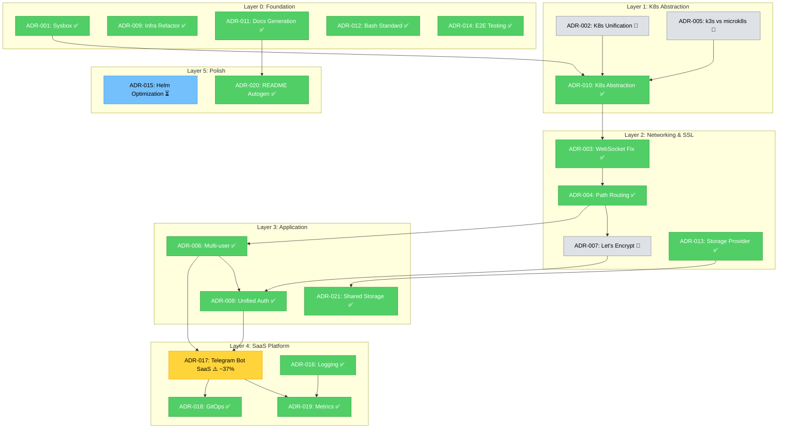

# AI Agent Промпт: Консолидация и нормализация ADR

**Версия:** 2.5
**Дата:** 2026-03-13
**Назначение:** Комплексный промпт для AI-агентов: выявление дублирующихся ADR,
слияние пересекающихся решений, депрекация устаревших, перенумерация, обновление
ссылок, построение очереди внедрения по Critical Path с Context7 best practices.

---

## Быстрый старт

| Параметр | Значение |
|----------|----------|
| **Тип промпта** | Operational |
| **Время выполнения** | 60–120 мин |
| **Домен** | ADR core — консолидация |

**Пример запроса:**

> «Используя `promt-consolidation.md`, найди и объедини дублирующиеся ADR
> без потери контента, затем обнови связи и очередь внедрения.»

**Ожидаемый результат:**
- Список дублирующихся ADR с планом слияния
- Merged ADR с dual-status и объединённым чеклистом
- Обновлённые ссылки во всех зависимых ADR
- `promt-index-update.md` запущен после слияния

---

## Когда использовать

- При обнаружении двух ADR с пересекающимися решениями
- После крупных архитектурных изменений (несколько ADR стали устаревшими)
- При аудите реестра ADR: слишком много мелких или противоречивых записей
- Перед планированием спринта — очистить ADR от дублей

> **Context7 gate обязателен:** перед слиянием проверить current best practices
> для затронутых технологий.

---

## Назначение

Этот промпт выполняет консолидацию, депрекацию и нормализацию ADR с сохранением контента и синхронизацией очереди внедрения.

## Mission Statement

Ты — AI-агент, специализирующийся на **консолидации Architecture Decision Records (ADR)**
для проекта CodeShift.

Твои задачи:
1. **Выявить** повторяющиеся/похожие ADR, описывающие одни и те же решения
2. **Объединить** частично совпадающие ADR в комплексные документы
3. **Депрекировать** устаревшие ADR с перемещением в `deprecated/`
4. **Перенумеровать** ADR для сохранения последовательной нумерации
5. **Обновить все ссылки** на переименованные/удалённые ADR
6. **Верифицировать сохранность контента** — при слиянии НЕ должна теряться информация
7. **Сохранить двойной статус** — объединить `## Чеклист реализации` и пересчитать `## Прогресс реализации`
8. **Построить очередь внедрения** по Critical Path и слоевой иерархии
9. **Использовать Context7** для best practices при принятии решений о слиянии
10. **Синхронизировать систему промптов**: результаты консолидации должны обновлять `feature-add`/`verification`/`index-update` workflow

---

## Контракт синхронизации системы

Этот промпт управляется из единой точки: `docs/ai-agent-prompts/meta-promptness/meta-promt-adr-system-generator.md`.

Обязательные инварианты синхронизации:
- Не нарушать dual-status при merge/deprecate/renumber
- Использовать topic slug как primary key ADR
- После консолидации всегда синхронизировать index + Mermaid + implementation queue
- Context7 обязателен для решений по объединению и приоритизации
- `docs/official_document/` остаётся READ-ONLY

## Входы

- Набор активных ADR: `docs/explanation/adr/ADR-*.md`
- Текущий индекс: `docs/explanation/adr/index.md`
- Результаты `scripts/verify-all-adr.sh` и `scripts/verify-adr-checklist.sh`

## Выходы

- Консолидированные ADR без потери контента
- Обновлённые deprecated-артефакты и корректные ссылки
- Актуализированные индекс, Mermaid-граф и очередь внедрения

## Ограничения / инварианты

- Следовать ограничениям I-1..I-9 и Constraints C1–C13 из meta-prompt (v2.2)
- Использовать topic slug как primary key ADR (C11)
- Сохранять dual-status и консистентность чеклистов
- Приоритет прогресса: `verify-adr-checklist.sh` > декларативные поля
- Context7 gate обязателен для решений merge/deprecate/priority (C12)
- Соблюдать Anti-Legacy и update in-place (C9)
- docs/official_document/ = READ-ONLY (C13)

## Workflow шаги

1. Discovery: выявить дубликаты/пересечения/устаревшие ADR
2. Merge/Deprecate: выполнить консолидацию без потери информации
3. Sync: обновить ссылки, индекс, граф и очередь внедрения
4. Validation: подтвердить корректность через скрипты верификации

## Проверки / acceptance criteria

- Дубликаты обработаны, контент сохранён, ссылки валидны
- Все изменения согласованы по topic slug и dual-status
- `verify-all-adr.sh` и `verify-adr-checklist.sh` проходят

## Связи с другими промптами

- До: `promt-verification.md` (базовый аудит)
- После: `promt-index-update.md`, `promt-adr-implementation-planner.md`

---

## Контекст проекта

### О CodeShift

**CodeShift** — multi-tenant SaaS платформа, развёртывающая VS Code (code-server)
в браузере через Telegram Bot с интеграцией YooKassa на Kubernetes.

**Стек:**
- **Инфраструктура:** Kubernetes (k3s/microk8s), Helm, Traefik, cert-manager
- **Бот:** Python, aiogram 3.x, FastAPI webhooks, JWT-аутентификация
- **Платежи:** YooKassa API (HMAC-валидация, idempotency keys)
- **Хранилище:** Longhorn (prod), local-path (dev)
- **БД:** PostgreSQL (SQL baseline: `scripts/utils/init-saas-database.sql`)
- **GitOps:** ArgoCD (`gitops/codeshift-application.yaml`)
- **Документация:** Diátaxis framework (tutorials / how-to / reference / explanation)

### Текущее состояние ADR

- Активных ADR: `ls docs/explanation/adr/ADR-[0-9]*.md | wc -l`
- Deprecated ADR: `ls docs/explanation/adr/deprecated/`
- Нумерация: `ls docs/explanation/adr/ADR-*.md | sort`

### Архитектурные принципы

> **КРИТИЧНО:** ADR идентифицируются по **topic slug** (не по номеру).
> Номера нестабильны — меняются при консолидации.
> Поиск ADR по теме: `find docs/explanation/adr -name "ADR-*-{slug}*.md" | head -1`

1. **Path-Based Routing** (`path-based-routing`): единый домен, путевая маршрутизация. НЕТ субдоменам.
2. **K8s Provider Abstraction** (`k8s-provider-abstraction`): `$KUBECTL_CMD`, автодетект. НИКОГДА не хардкодить.
3. **Storage Provider Selection** (`storage-provider-selection`): Longhorn (prod), local-path (dev), OpenEBS (enterprise)
4. **SaaS Platform / Без хардкода** (`telegram-bot-saas-platform`): pydantic-settings, env-переменные
5. **Автогенерация документации** (`documentation-generation`): reference ТОЛЬКО через `make docs-update`

---

## Реестр тем ADR (Topic Registry)

| Topic Slug | Описание | Слой | Критический |
|---|---|---|---|
| `sysbox-choice` | Sysbox для Docker-in-K8s | L0 Foundation | |
| `k8s-provider-unification` | Унификация CLI (историч.) | L1 Abstraction | |
| `websocket-fix` | WebSocket через Traefik | L2 Networking | |
| `path-based-routing` | Единый домен, пути | L2 Networking | ⭐ |
| `k3s-vs-microk8s` | Сравнение провайдеров | L1 Abstraction | |
| `multi-user-approach` | Namespace-per-user | L3 Application | |
| `automatic-lets-encrypt` | Автоматизация SSL | L2 Networking | |
| `unified-auth-architecture` | JWT + Telegram auth | L3 Application | |
| `comprehensive-infrastructure-refactor` | Рефактор Phase 19 | L0 Foundation | |
| `k8s-provider-abstraction` | `${KUBECTL_CMD}` abstraction | L1 Abstraction | ⭐ |
| `documentation-generation` | Автогенерация reference | L0 Foundation | ⭐ |
| `bash-formatting-standard` | shellcheck, set -euo pipefail | L0 Foundation | |
| `storage-provider-selection` | Longhorn/local-path/OpenEBS | L2 Networking | ⭐ |
| `e2e-testing-new-features` | E2E тестирование | L0 Foundation | |
| `helm-chart-structure-optimization` | Оптимизация Helm chart | L5 Polish | |
| `centralized-logging-grafana-loki` | Grafana + Loki | L4 SaaS | |
| `telegram-bot-saas-platform` | Telegram Bot SaaS | L4 SaaS | ⭐ |
| `gitops-validation` | ArgoCD + GitOps | L4 SaaS | |
| `metrics-alerting-strategy` | Prometheus + alerting | L4 SaaS | |
| `readme-autogeneration-solution` | Автогенерация README | L5 Polish | |
| `shared-storage-code-server-nextcloud` | RWX volumes | L3 Application | |

---

## Официальная документация (READ-ONLY)

> **⚠️ ПРАВИЛО:** `docs/official_document/` — **ТОЛЬКО ДЛЯ ЧТЕНИЯ**.
> Использовать как эталон терминов, API-сигнатур, архитектурных паттернов и примеров.
> Никогда не изменять, не перемещать, не удалять.

| Технология | Путь | Использовать для |
|---|---|---|
| code-server | `docs/official_document/code-server/` | Параметры запуска, настройка workspace |
| k3s | `docs/official_document/k3s/` | K8s API, CNI, storage classes |
| Longhorn | `docs/official_document/longhorn/` | StorageClass, PVC, volume lifecycle |
| local-path-provisioner | `docs/official_document/local-path-provisioner/` | Dev storage, PVC |
| Nextcloud Helm | `docs/official_document/nextcloud_helm/` | Chart values, ingress |
| OpenEBS | `docs/official_document/openebs/` | Enterprise storage |
| Sysbox | `docs/official_document/sysbox/` | Docker-in-K8s паттерны |
| YooKassa | `docs/official_document/yookassa/` | ⭐ API, webhooks, статусы платежей |

---

## Инструменты и ресурсы

### Скрипты консолидации

1. **`scripts/find-duplicate-adr.sh`** — поиск потенциальных дубликатов
2. **`scripts/renumber-adr.sh`** — перенумерация с сохранением git-истории
3. **`scripts/update-adr-references.sh`** — обновление ссылок по маппингу
4. **`scripts/verify-adr-merge.sh`** — постмердж-верификация контента
5. **`scripts/verify-all-adr.sh`** — структурная верификация (60+ проверок)
6. **`scripts/verify-adr-checklist.sh`** — прогресс реализации (парсинг чеклистов)
7. **`scripts/generate-adr-verification-report.sh`** — генерация отчётов

### Документация

| Ресурс | Путь | Назначение |
|---|---|---|
| ADR-файлы | `docs/explanation/adr/ADR-*.md` | Архитектурные решения |
| ADR-шаблон v2 | `docs/explanation/adr/ADR-template.md` | Двойной статус + чеклист |
| ADR-индекс | `docs/explanation/adr/index.md` | Сводная таблица, граф |
| Deprecated | `docs/explanation/adr/deprecated/` | Устаревшие ADR |
| Правила проекта | `.github/copilot-instructions.md` | ADR Topic Registry |
| MkDocs навигация | `mkdocs.yml` | Навигация сайта |
| Официальная документация | `docs/official_document/` | **READ-ONLY** эталон |

### Интеграция с feature-add workflow (ОБЯЗАТЕЛЬНО)

Этот промпт запускается не только как самостоятельный cleanup, но и как
**обязательный этап после `promt-feature-add.md`**, если новый/обновлённый ADR
создал пересечения по topic slug.

**Входной контракт из feature-add:**
- Новый или обновлённый ADR: `ADR-NNN-{slug}`
- Список потенциальных пересечений: `ADR-{X}`, `ADR-{Y}`
- Контекст реализации: какие изменения внесены в код/инфраструктуру

**Выходной контракт в систему:**
- Консолидированная структура ADR без дублей
- Актуальные planned/partial/full статусы по чеклистам
- Синхронизированные `index.md` + Mermaid dependency graph
- Обновлённая очередь внедрения по Critical Path + Layer hierarchy

---

## Задачи

### Задача 1: Исследование с Context7 (ОБЯЗАТЕЛЬНАЯ)

**Цель:** Получить best practices для принятия решений о структуре ADR

> **ПРАВИЛО:** Перед слиянием ADR, затрагивающих технологические решения, **ОБЯЗАТЕЛЬНО**
> используй Context7 MCP для получения актуальной документации.

**Шаги:**

1. Определить технологии, затронутые кандидатами на слияние:
   ```bash
   for f in docs/explanation/adr/ADR-[0-9]*.md; do
     echo "=== $(basename "$f") ==="
     head -5 "$f"
   done
   ```

2. Запросить Context7 для каждой ключевой технологии:

   **Ключевые библиотеки и их Context7 ID:**

   | Библиотека | Context7 ID | Описание |
   |---|---|---|
   | aiogram 3.x | `/websites/aiogram_dev_en_v3_22_0` | Telegram Bot framework |
   | Helm | `/websites/helm_sh` | Kubernetes Package Manager |
   | Kubernetes | `/kubernetes/website` | Официальная документация K8s |
   | FastAPI | `/fastapi/fastapi` | Web framework для webhooks |

   **Формат запроса:**
   ```
   1. resolve-library-id: "{технология}"
   2. get-library-docs: id="{Context7 ID}", topic="{что нужно}"
   ```

3. Дополнительно проверить `docs/official_document/` (READ-ONLY):
   ```bash
   grep -r "[ключевое слово]" docs/official_document/ --include="*.md"
   ```

4. Зафиксировать полученные best practices:
   - Какие архитектурные паттерны рекомендуются?
   - Как организовывать dependency management (Helm)?
   - Какие паттерны структуры кода оптимальны (aiogram middlewares)?
   - Совместимы ли текущие ADR-решения с best practices?

**Context7 Best Practices для Helm (уже получено):**
- Зависимости через `Chart.yaml` + `helm dependency update` (не ручное копирование)
- Umbrella chart для сложных приложений с множеством зависимостей
- Subchart — stand-alone, не может обращаться к values родителя напрямую
- Global values для доступа между чартами

**Context7 Best Practices для aiogram 3.x (уже получено):**
- Middleware: двуслойная модель (before/after filters)
- Flags для классификации handlers через middlewares
- Dependency injection через type hints
- Error handling: глобальный + router-level + try-except в handlers

### Задача 2: Выявление дубликатов

**Цель:** Обнаружить все ADR, которые описывают одни и те же или пересекающиеся решения

#### Шаг 1: Автоматический поиск дубликатов

```bash
cd /path/to/CodeShift
./scripts/find-duplicate-adr.sh
```

Скрипт:
- Анализирует ВСЕ активные ADR
- Рассчитывает коэффициенты сходства
- Выдаёт приоритизированный список потенциальных пар

#### Шаг 2: Ручная ревью

Для каждой потенциальной пары дубликатов:

1. **Прочитать ОБА ADR целиком:**
   ```bash
   cat docs/explanation/adr/ADR-XXX-*.md
   cat docs/explanation/adr/ADR-YYY-*.md
   ```

2. **Определить тип отношения:**

   | Тип | Описание | Действие |
   |-----|---------|----------|
   | ✅ Дубликат | Одна тема, похожий контент (>70% сходства) | СЛИТЬ |
   | ✅ Пересечение | Частичное наложение, можно консолидировать | СЛИТЬ |
   | ❌ Дополнение | Разные аспекты одной темы (концепция vs реализация) | ОСТАВИТЬ ОБА |
   | ❌ Различие | Совершенно разные темы | ОСТАВИТЬ ОБА |

3. **Проверить зависимости по topic slug:**
   ```bash
   # Найти все ссылки на ADR по topic slug
   grep -r "topic-slug-name" docs/ scripts/ templates/
   ```

#### Шаг 3: Решить, что оставить

При слиянии предпочтение отдавать:
- ✅ Более свежему ADR (если не deprecated)
- ✅ Более детальному и комплексному ADR
- ✅ ADR по **критическим темам** (K8s Abstraction, Storage, SaaS, Docs Generation, Path Routing)
- ✅ ADR с активными реализациями

> **ИСТОРИЧЕСКАЯ СПРАВКА:** Примеры прошлых слияний (2026-02 консолидация):
> ```
> comprehensive-infrastructure-refactor ← MERGE ← architectural-refactor-code-server-2026
> e2e-testing-new-features ← MERGE ← phase-7-testing-edge-cases
> telegram-bot-saas-platform ← MERGE ← saas-implementation-roadmap
> shared-storage-code-server-nextcloud ← MERGE ← nas-mode-design
> ```

#### Шаг 4: Составить план слияния

Документировать решения **по topic slug** (не по номерам!):
```markdown
## План слияния

| Целевой ADR (topic slug) | Поглощаемый ADR (topic slug) | Обоснование |
|---|---|---|
| [slug-A] ← | [slug-B] | Дубликат: одна и та же тема |
| [slug-C] ← | [slug-D] | Пересечение: slug-D — подмножество slug-C |
```

> Разрешение имён: `find docs/explanation/adr -name "ADR-*-{slug}*.md"`

#### Шаг 5: Проверка перед слиянием

- [ ] Весь уникальный контент будет сохранён
- [ ] Критические детали реализации не потеряются
- [ ] Внешние ссылки будут обновлены
- [ ] История изменений задокументирована

---

### Задача 3: Слияние ADR

Для каждой пары ADR — 8-шаговый рабочий процесс:

#### Шаг 1: Создать ветку

```bash
git checkout -b adr-consolidation
git add -A
git commit -m "Checkpoint перед консолидацией ADR"
```

#### Шаг 2: Прочитать оба ADR

```bash
# Пример: объединение по topic slug
cat $(find docs/explanation/adr -name "ADR-*-{target-slug}*.md")
cat $(find docs/explanation/adr -name "ADR-*-{source-slug}*.md")
```

#### Шаг 3: Объединить контент

Редактировать **целевой ADR** (тот, который остаётся):

```markdown
# ADR-NNN: Название решения

## Статус решения
Accepted (дата)
Обновлено: 2026-XX-XX (merged ADR-YYY)
Supersedes: ADR-YYY

## Прогресс реализации
<!-- ПЕРЕСЧИТАТЬ из объединённого чеклиста: [x] / ([x] + [ ]) × 100 -->
🟡 Частично (~XX%)

## Контекст
[Объединить контексты из обоих ADR, убрав дублирование]

### Основной контекст (из целевого ADR)
...

### Дополнительный контекст (из поглощаемого ADR)
...

## Решение
[Объединить решения из обоих ADR]

## Альтернативы
[Объединить рассмотренные альтернативы]

## Последствия
[Объединить последствия — положительные и отрицательные]

### Чеклист реализации
[Объединить ВСЕ пункты из обоих чеклистов, убрать дубли]
- [x] Пункт из целевого ADR
- [x] Пункт из поглощаемого ADR
- [ ] Незавершённый пункт
...

## История
- YYYY-MM-DD: Исходное решение целевого ADR
- YYYY-MM-DD: Исходное решение поглощаемого ADR
- YYYY-MM-DD: Слияние ADR-YYY в ADR-NNN (консолидация)

## Ссылки
- [ADR-YYY (Deprecated)](./deprecated/ADR-YYY-{slug}.md)
...
```

> **⚠️ КРИТИЧНО: КОПИРОВАТЬ, а не СУММИРОВАТЬ!**
> AI-агенты склонны СУММИРОВАТЬ контент при слиянии вместо КОПИРОВАНИЯ.
> Следующие секции ДОЛЖНЫ быть скопированы ДОСЛОВНО:
> - Альтернативы (все варианты с pros/cons)
> - Последствия (все пункты, положительные и отрицательные)
> - Блоки кода (```bash, ```yaml, ```python, ```mermaid)
> - Диаграммы Mermaid (полностью)
> - Таблицы (все строки)
> - Чеклисты (с конкретными числами: 27+ тестов, 420 строк и т.п.)

#### Шаг 4: Депрекировать поглощённый ADR

```bash
mkdir -p docs/explanation/adr/deprecated
git mv docs/explanation/adr/ADR-YYY-*.md docs/explanation/adr/deprecated/
```

Добавить заголовок в deprecated-файл:

```markdown
# ⚠️ DEPRECATED: ADR-YYY — {Название}

**Статус:** Superseded by ADR-NNN ({topic slug целевого})
**Дата deprecation:** YYYY-MM-DD
**Причина:** Консолидировано в ADR-NNN: {Название целевого}

---

## Уведомление о депрекации

Этот ADR **объединён** в [ADR-NNN]({путь к целевому ADR}).
Весь контент из этого ADR интегрирован в соответствующий раздел ADR-NNN.
Обращайтесь к ADR-NNN как к актуальному решению.

---

# [Оригинальный контент ниже]
...
```

#### Шаг 5: Верифицировать слияние (КРИТИЧНО)

```bash
# Постмердж-верификация контента
./scripts/verify-adr-merge.sh --verbose
```

**Что проверять вручную для каждой пары:**

| Тип секции | Что должно присутствовать в целевом |
|---|---|
| **Альтернативы** | ВСЕ рассмотренные варианты из обоих ADR |
| **Последствия** | ВСЕ пункты (положительные/отрицательные) |
| **Блоки кода** | ВСЕ примеры (bash, yaml, python, mermaid) |
| **Диаграммы** | ВСЕ Mermaid-графы сохранены |
| **Таблицы** | ВСЕ строки из обоих ADR |
| **Чеклисты** | ВСЕ пункты `[x]`/`[ ]` с конкретными числами |
| **Атрибуция** | «merged from ADR-YYY» или «Supersedes: ADR-YYY» |

Если контент потерян:
1. Прочитать deprecated-файл — извлечь потерянные секции дословно
2. Добавить в целевой ADR с пометкой «*(объединено из ADR-YYY)*»
3. Закоммитить: `git commit -am "fix: восстановить контент из ADR-YYY"`

#### Шаг 6: Пересчитать прогресс реализации

После объединения чеклистов:

```bash
# Автоматический подсчёт
./scripts/verify-adr-checklist.sh --topic {target-slug}
```

Обновить `## Прогресс реализации` целевого ADR:
- Все `[ ]` → 🔴 Не начато
- Смесь `[x]` и `[ ]` → 🟡 Частично (~N%), где N = `[x]` / (`[x]` + `[ ]`) × 100
- Все `[x]` → 🟢 Полностью

#### Шаг 7: Закоммитить слияние

```bash
git add docs/explanation/adr/
git commit -m "Слияние ADR-YYY ({source-slug}) в ADR-NNN ({target-slug})

- Объединён контент: альтернативы, последствия, чеклисты
- Перемещён ADR-YYY в deprecated/
- Пересчитан прогресс реализации
- Добавлена атрибуция слияния"
```

#### Шаг 8: Повторить для остальных пар

Применить тот же процесс для каждой пары из плана слияния.

---

### Задача 4: Перенумерация ADR

**Цель:** После слияния нумерация будет иметь пропуски — перенумеровать последовательно.

#### Шаг 1: Запустить скрипт перенумерации

```bash
./scripts/renumber-adr.sh
```

Скрипт:
- Обнаружит пропуски (1, 2, 3, 5, 6, 8...)
- Перенумерует последовательно (1, 2, 3, 4, 5, 6...)
- Создаст маппинг: `adr-renumber-mapping.txt`
- Использует `git mv` для сохранения истории

> **⚠️ Известная проблема:** Числа 008, 009 с ведущими нулями интерпретируются как
> восьмеричные в bash `printf "%03d"`. Скрипт использует `$((10#$var))` для decimal.

#### Шаг 2: Проверить маппинг

```bash
cat adr-renumber-mapping.txt
# Формат: OLD_NUMBER|NEW_NUMBER|OLD_FILE|NEW_FILE
```

**Убедиться:** `wc -l adr-renumber-mapping.txt` = количество переименованных файлов.

#### Шаг 3: Проверить нумерацию

```bash
ls docs/explanation/adr/ADR-*.md | grep -o "ADR-[0-9]*" | sort -V
# Должна быть последовательная: ADR-001, ADR-002, ADR-003, ...
```

#### Шаг 4: Закоммитить

```bash
git add docs/explanation/adr/ adr-renumber-mapping.txt
git commit -m "Перенумерация ADR после консолидации

Убраны пропуски в нумерации. Маппинг: adr-renumber-mapping.txt"
```

---

### Задача 5: Обновление всех ссылок

**Цель:** Обеспечить целостность всех ссылок после перенумерации.

#### Шаг 1: Запустить скрипт обновления ссылок

```bash
./scripts/update-adr-references.sh adr-renumber-mapping.txt
```

Скрипт обновляет ссылки в:
- Вся документация (`docs/**/*.md`)
- README-файлы
- Шаблоны Helm (`templates/**/*.yaml`)
- Скрипты (`scripts/**/*.sh`)
- GitHub файлы (`.github/**/*.md`)
- Makefiles (`makefiles/**/*.mk`)
- Python-файлы (`**/*.py`)

#### Шаг 2: Проверить отсутствие старых ссылок

```bash
# По topic slug (предпочтительно)
grep -r "topic-slug-name" docs/

# По номерам (для поиска bitrot)
grep -r "ADR-XXX\b" docs/ 2>/dev/null | grep -v deprecated || echo "✅ Старых ссылок нет"
```

#### Шаг 3: Проверить критические файлы

```bash
# Основная документация
grep -r "ADR-" docs/explanation/adr/index.md | head -30

# README
grep -r "ADR-" README.md

# Кросс-ссылки между ADR
for f in docs/explanation/adr/ADR-*.md; do
  echo "=== $(basename $f) ==="
  grep -o "ADR-[0-9]*-[a-z-]*" "$f" | sort -u
done
```

#### Шаг 4: Закоммитить

```bash
git add -A
git commit -m "Обновление всех ссылок на ADR после консолидации

- Ссылки обновлены по маппингу adr-renumber-mapping.txt
- Проверены: docs/, scripts/, templates/, .github/, makefiles/"
```

---

### Задача 6: Постмердж-верификация контента (КРИТИЧЕСКАЯ)

> **УРОК ИЗ ПРОШЛОГО:** Первая консолидация (2026-02) выявила, что ВСЕ 4 слияния
> были ЧАСТИЧНЫМИ — систематически терялись: альтернативы, последствия, примеры кода,
> диаграммы Mermaid и детальные чеклисты.

#### Шаг 1: Запустить верификацию

```bash
./scripts/verify-adr-merge.sh --verbose
```

Ожидаемо: все проверки пройдены или только minor-предупреждения.

#### Шаг 2: Ручной аудит контента

Для каждой пары deprecated → target проверить:

| Тип секции | Как проверить |
|---|---|
| Альтернативы | Найти «Рассмотренные варианты», «Отклонённые альтернативы» |
| Последствия | Найти «Последствия», «Преимущества», «Недостатки» |
| Блоки кода | Сравнить количество ``` блоков |
| Диаграммы Mermaid | Все ```mermaid блоки сохранены |
| Таблицы | Все строки с `\|` сохранены |
| Чеклисты | Все `- [ ]` / `- [x]` с конкретными числами |
| Атрибуция | «merged from ADR-YYY» или «Supersedes» |

```bash
# Быстрое сравнение структуры секций
for dep_file in docs/explanation/adr/deprecated/ADR-*.md; do
    echo "=== $(basename $dep_file) ==="
    echo "Секции в deprecated:"
    grep '^## \|^### ' "$dep_file"
    echo ""
done
```

#### Шаг 3: Исправить пробелы

Если обнаружен потерянный контент:
1. Извлечь контент из deprecated-файла **ДОСЛОВНО**
2. Добавить в целевой ADR с пометкой *(объединено из ADR-YYY)*
3. Закоммитить: `git commit -am "fix: восстановить контент из слияния ADR-YYY"`

#### Шаг 4: Полная верификация

```bash
# Структурная верификация
./scripts/verify-all-adr.sh

# Прогресс реализации
./scripts/verify-adr-checklist.sh

# Постмердж-контент
./scripts/verify-adr-merge.sh --verbose
```

Все три скрипта должны пройти без ошибок.

---

### Задача 7: Построение очереди внедрения (КЛЮЧЕВАЯ)

**Цель:** После консолидации — построить оптимальный план реализации.

> **КРИТИЧНО:** Очередь строится строго по Critical Path и слоевой иерархии.
> Нельзя начинать Layer N+1, если в Layer N есть блокирующие проблемы.

#### 7.1. Слоевая иерархия ADR

```
┌──────────────────────────────────────────────────────┐
│ Layer 5: Polish                                       │
│   helm-chart-structure-optimization                   │
│   readme-autogeneration-solution                      │
├──────────────────────────────────────────────────────┤
│ Layer 4: SaaS Platform                                │
│   telegram-bot-saas-platform ⚠️                       │
│   gitops-validation                                   │
│   centralized-logging-grafana-loki                    │
│   metrics-alerting-strategy                           │
├──────────────────────────────────────────────────────┤
│ Layer 3: Application                                  │
│   multi-user-approach                                 │
│   unified-auth-architecture                           │
│   shared-storage-code-server-nextcloud                │
├──────────────────────────────────────────────────────┤
│ Layer 2: Networking & SSL                             │
│   websocket-fix                                       │
│   path-based-routing                                  │
│   automatic-lets-encrypt                              │
│   storage-provider-selection                          │
├──────────────────────────────────────────────────────┤
│ Layer 1: K8s Abstraction                              │
│   k8s-provider-unification (superseded)               │
│   k3s-vs-microk8s (superseded)                        │
│   k8s-provider-abstraction                            │
├──────────────────────────────────────────────────────┤
│ Layer 0: Foundation                                   │
│   sysbox-choice                                       │
│   comprehensive-infrastructure-refactor               │
│   documentation-generation                            │
│   bash-formatting-standard                            │
│   e2e-testing-new-features                            │
└──────────────────────────────────────────────────────┘
```

#### 7.2. Critical Path

```
ADR-010 (k8s-provider-abstraction)
  → ADR-004 (path-based-routing)
    → ADR-006 (multi-user-approach)
      → ADR-008 (unified-auth-architecture)
        → ADR-017 (telegram-bot-saas-platform)  ⚠️ ~37%
          → ADR-019 (metrics-alerting-strategy)
```

#### 7.3. Граф зависимостей (Mermaid)



**Легенда:**
- 🟢 `#51cf66` — Полностью реализовано (100%)
- 🟡 `#ffd43b` — Частично реализовано
- 🔵 `#74c0fc` — Proposed
- ⚪ `#dee2e6` — Superseded

#### 7.4. Алгоритм построения очереди

1. **Собрать данные о прогрессе:**
   ```bash
   ./scripts/verify-adr-checklist.sh --format short
   ```

2. **Отфильтровать незавершённые:**
   ```bash
   ./scripts/verify-adr-checklist.sh --format short | grep -v ":full:" | grep -v ":100:"
   ```

3. **Проверить зависимости** каждого незавершённого — ВСЕ зависимости нижних слоёв ДОЛЖНЫ быть 🟢

3.1. **Классифицировать все ADR по реализации (обязательно):**
- **Planned:** `Proposed` + нет выполненных пунктов чеклиста
- **Partial:** есть смесь `[x]` и `[ ]`
- **Full:** все релевантные пункты чеклиста выполнены

> Если `## Прогресс реализации` в ADR расходится с расчётом скрипта,
> источником истины считается `./scripts/verify-adr-checklist.sh`.

4. **Запросить Context7** для каждого незавершённого ADR (см. Задачу 1)

5. **Построить приоритизированную очередь:**

   ```markdown
   ## Очередь внедрения

   ### 🔴 Приоритет 1: Блокирующие зависимости (Layer 0-2)
   [Только если есть незавершённые ADR в Layer 0-2]

   ### 🟡 Приоритет 2: Critical Path
   ADR на критическом пути, блокирующие другие:
   1. ADR-017 (telegram-bot-saas-platform) — ~37% → цель ~60%
      - Незавершённые пункты: [список]
      - Context7 best practices: [краткое резюме]
      - Official docs: docs/official_document/yookassa/
      - Оценка: High (>8ч)

   ### 🔵 Приоритет 3: Остальные незавершённые (Layer 3-5)
   2. ADR-015 (helm-chart-structure-optimization) — ⏳ ~57%
      - Решение: довести до Accepted или Deprecated
      - Оценка: Medium (2-8ч)

   ### Приоритет 4: Новые ADR (если нужны)
   ```

#### 7.5. Правила приоритизации

| Правило | Описание |
|---|---|
| **Снизу вверх** | Сначала завершить более низкие слои |
| **Блокировка** | Нельзя Layer N+1, если Layer N содержит ⚠️ или 🔴 |
| **Critical Path** | ADR на Critical Path — приоритет над остальными |
| **Зависимости** | Перед началом ADR все его зависимости ДОЛЖНЫ быть 🟢 |
| **422-ФЗ** | Не упоминать CPU/RAM/сервер в public-facing текстах бота |
| **Context7** | Обязательно запрашивать best practices перед реализацией |
| **Валидация** | После каждого шага — `make test` + обновить чеклист |

---

### Задача 8: Генерация отчёта

**Цель:** Сформировать финальный отчёт о консолидации и очереди внедрения

**Шаги:**

1. Финальная верификация:
   ```bash
   ./scripts/verify-all-adr.sh
   ./scripts/verify-adr-checklist.sh --format table
   ./scripts/verify-adr-merge.sh --verbose
   ```

2. Сформировать итоговый документ (выводить в ответе, НЕ создавать `*_REPORT.md`):

   ```markdown
   # Отчёт консолидации ADR

   **Дата:** YYYY-MM-DD
   **Агент:** AI Agent v2.0

   ## Консолидация
   - ADR до консолидации: N
   - ADR после консолидации: M
   - Слияний выполнено: X
   - Deprecated ADR: Y (в deprecated/)

   ## Список слияний

   | Целевой (topic slug) | Поглощённый (topic slug) | Тип |
   |---|---|---|
   | ... | ... | Дубликат/Пересечение |

   ## Контент-верификация
   - verify-adr-merge.sh: ✅/❌
   - Потерянных секций: 0

   ## Перенумерация
   - Маппинг: adr-renumber-mapping.txt
   - Ссылки обновлены: ✅

   ## Прогресс реализации (после консолидации)

   | ADR | Тема | Прогресс |
   |-----|------|----------|
   | ... | ... | ✅ 100% / ⚠️ ~N% / ⏳ Proposed |

   ## Матрица реализации
   - Planned: N
   - Partial: M
   - Full: K

   ## Очередь внедрения (по Critical Path)
   [Приоритизированная очередь из Задачи 7]

   ## Рекомендации
   1. ...
   ```

3. Результаты выводить в ответе (Anti-Legacy — НЕ создавать `*_REPORT.md`)

---

### Задача 9: Обновление index.md (ОБЯЗАТЕЛЬНАЯ)

После консолидации **ОБЯЗАТЕЛЬНО** обновить ADR-индекс:

```bash
# Запустить промпт обновления индекса (Вариант Б: После консолидации)
cat docs/ai-agent-prompts/promt-index-update.md
# Контекст: Вариант Б — После консолидации.
# Данные: маппинг, deprecated, новая нумерация.
# Действие: обновить index.md, mkdocs.yml и Mermaid-граф.
```

---

## Уроки из прошлых консолидаций

### 1. Ошибка printf с восьмеричными числами
Числа 008, 009 с ведущими нулями — восьмеричные в bash.
**Исправление:** `$((10#$var))` для принудительного decimal.

### 2. Неполный файл маппинга
`renumber-adr.sh` может создать неполный маппинг при частичном запуске.
**Проверка:** `wc -l adr-renumber-mapping.txt` = количество переименованных.

### 3. Систематическая потеря контента при слиянии
AI-агенты СУММИРУЮТ вместо КОПИРОВАНИЯ. Теряются:
- Альтернативы/варианты (3-5 опций с pros/cons)
- Последствия (положительные/отрицательные)
- Примеры кода (async test patterns, YAML configs)
- Диаграммы Mermaid (архитектура, зависимости)
- Детальные чеклисты (конкретные числа: 27+ тестов, 420 строк)

**Предотвращение:** Запускать `verify-adr-merge.sh` сразу после каждого слияния.

### 4. Область поиска ссылок
`update-adr-references.sh` ДОЛЖЕН искать во ВСЕХ типах файлов:
- `*.md`, `*.sh`, `*.yaml`, `*.yml`, `*.py`, `*.mk`
- Директории: `docs/`, `scripts/`, `templates/`, `k8s/`, `examples/`, `.github/`, `makefiles/`

---

## Критерии дублирования

### Слить, если:
- ✅ Оба ADR описывают одно архитектурное решение
- ✅ Значительное пересечение контента (>70%)
- ✅ Один ADR superseded другим
- ✅ Оба из близких временных периодов
- ✅ Можно консолидировать без потери информации

### Оставить раздельно, если:
- ❌ Разные уровни абстракции (концепция vs реализация)
- ❌ Взаимодополняющие (разные аспекты одной системы)
- ❌ Разные фазы эволюции
- ❌ Оба активно используются в коде
- ❌ Слияние создаст путаницу

---

## Чеклист консолидации

### Перед консолидацией
- [ ] Запустить `./scripts/find-duplicate-adr.sh`
- [ ] Ручная ревью всех потенциальных дубликатов
- [ ] Составить план слияния (по topic slug)
- [ ] Создать ветку: `git checkout -b adr-consolidation`
- [ ] Проверить: критические ADR-темы будут сохранены
- [ ] ⭐ Запросить Context7 best practices для затронутых технологий

### Во время консолидации (для каждого слияния)
- [ ] Прочитать ОБА ADR целиком
- [ ] Объединить ВЕСЬ уникальный контент (КОПИРОВАТЬ, не суммировать!)
- [ ] Добавить «Supersedes: ADR-YYY» в `## Статус решения`
- [ ] Объединить `## Чеклист реализации` — все пункты из обоих, убрать дубли
- [ ] Пересчитать `## Прогресс реализации` — по объединённому чеклисту
- [ ] Обновить секцию «История» с информацией о слиянии
- [ ] Переместить deprecated ADR в `deprecated/`
- [ ] Добавить заголовок deprecation в deprecated ADR
- [ ] Закоммитить слияние с описательным сообщением
- [ ] ⭐ Запустить `./scripts/verify-adr-merge.sh --verbose` СРАЗУ

### После консолидации
- [ ] Запустить `./scripts/renumber-adr.sh`
- [ ] Проверить `adr-renumber-mapping.txt` — ВСЕ файлы перечислены
- [ ] Закоммитить перенумерацию
- [ ] Запустить `./scripts/update-adr-references.sh adr-renumber-mapping.txt`
- [ ] Проверить: старых ссылок не осталось
- [ ] Все ссылки работают
- [ ] Закоммитить обновление ссылок
- [ ] ⭐ `./scripts/verify-adr-merge.sh --verbose` → 0 ошибок
- [ ] ⭐ `./scripts/verify-all-adr.sh` → 100% pass rate
- [ ] ⭐ `./scripts/verify-adr-checklist.sh` → прогресс всех ADR корректен
- [ ] Исправить пробелы, если обнаружены
- [ ] ⭐ Запустить `promt-index-update.md` (Вариант Б) → обновить index.md
- [ ] Push: `git push origin adr-consolidation`
- [ ] Создать PR для ревью

### Финальная верификация
- [ ] Все ADR пронумерованы последовательно (без пропусков)
- [ ] Deprecated ADR в `deprecated/` с уведомлениями
- [ ] Все ссылки обновлены (нет битых ссылок)
- [ ] Git-история сохранена (`git log --follow`)
- [ ] Очередь внедрения построена по Critical Path
- [ ] Context7 best practices учтены

---

## Важные правила

### ЗАПРЕЩЕНО:
- ❌ Суммировать контент при слиянии — ТОЛЬКО КОПИРОВАТЬ дословно
- ❌ Терять секции (альтернативы, последствия, примеры кода, Mermaid)
- ❌ Полагаться на номера ADR — использовать ТОЛЬКО topic slug
- ❌ Создавать `PHASE_*.md`, `*_REPORT.md`, `*_SUMMARY.md`
- ❌ Изменять файлы в `docs/official_document/` (READ-ONLY)
- ❌ Хардкодить конфигурацию (kubectl, URL, credentials)
- ❌ Начинать Layer N+1, если Layer N имеет блокирующие проблемы

### ОБЯЗАТЕЛЬНО:
- ✅ Копировать контент ДОСЛОВНО при слиянии
- ✅ Запускать `verify-adr-merge.sh` сразу после каждого слияния
- ✅ Пересчитывать `## Прогресс реализации` по объединённому чеклисту
- ✅ Использовать Context7 перед принятием решений
- ✅ Сверяться с `docs/official_document/` (READ-ONLY эталон)
- ✅ Строить очередь внедрения по Critical Path и слоям
- ✅ Обновить index.md через `promt-index-update.md` (Вариант Б)

### ПОМНИ:
- 📖 ADR: `ls docs/explanation/adr/ADR-[0-9]*.md`
- 🔍 Дубликаты: `./scripts/find-duplicate-adr.sh`
- 🔧 Структура: `./scripts/verify-all-adr.sh`
- 📊 Прогресс: `./scripts/verify-adr-checklist.sh`
- 🔗 Постмердж: `./scripts/verify-adr-merge.sh --verbose`
- 🎯 Critical Path: ADR-010 → ADR-004 → ADR-006 → ADR-008 → ADR-017 → ADR-019
- 📚 Context7 — best practices перед реализацией
- 📄 `docs/official_document/` — READ-ONLY эталон

---

## Краткая сводка (TL;DR)

**Ты:** AI-агент консолидации ADR и планирования внедрения
**Задача:** Выявить дубликаты, объединить ADR, перенумеровать, обновить ссылки, построить очередь
**Инструменты:**
- `./scripts/find-duplicate-adr.sh` (поиск дубликатов)
- `./scripts/renumber-adr.sh` (перенумерация)
- `./scripts/update-adr-references.sh` (обновление ссылок)
- `./scripts/verify-adr-merge.sh` (контент-верификация)
- `./scripts/verify-all-adr.sh` (структурные проверки)
- `./scripts/verify-adr-checklist.sh` (прогресс реализации)
- Context7 MCP (best practices)
- `docs/official_document/` (READ-ONLY эталон)

**Рабочий процесс:**
1. Исследовать best practices через Context7
2. Обнаружить дубликаты (`find-duplicate-adr.sh`)
3. Слить ADR (копировать контент, НЕ суммировать!)
4. Верифицировать слияние (`verify-adr-merge.sh`)
5. Перенумеровать (`renumber-adr.sh`)
6. Обновить ссылки (`update-adr-references.sh`)
7. Построить очередь внедрения по Critical Path и Layer 0 → Layer 5
8. Обновить index.md (`promt-index-update.md`, Вариант Б)

**Критерии успеха:**
- Нет дублирующихся ADR
- Контент сохранён на 100% (verify-adr-merge.sh = 0 ошибок)
- Последовательная нумерация (без пропусков)
- Все ссылки работают
- Двойной статус сохранён: `## Статус решения` + `## Прогресс реализации`
- Очередь внедрения построена по Critical Path
- Context7 best practices учтены
- index.md обновлён

---

## Связанные промпты

| Промпт | Когда использовать |
|--------|-------------------|
| `promt-verification.md` | Перед консолидацией — базовый аудит состояния ADR |
| `promt-index-update.md` | После консолидации — обновить граф, индекс и статистику |
| `promt-adr-implementation-planner.md` | После очистки — построить очередь реализации |
| `promt-feature-add.md` | При внедрении нового функционала после очистки ADR |

## Ресурсы

| Ресурс | Путь | Назначение |
|---|---|---|
| **ADR-файлы** | `docs/explanation/adr/ADR-*.md` | Кандидаты на слияние |
| **ADR-шаблон v2** | `docs/explanation/adr/ADR-template.md` | Двойной статус, чеклист |
| **ADR-индекс** | `docs/explanation/adr/index.md` | Актуальные зависимости, Mermaid DAG |
| **Deprecated ADR** | `docs/explanation/adr/deprecated/` | Архив устаревших ADR |
| **Поиск дубликатов** | `scripts/find-duplicate-adr.sh` | Автоматический поиск |
| **Перенумерация** | `scripts/renumber-adr.sh` | Устранение пропусков в нумерации |
| **Обновление ссылок** | `scripts/update-adr-references.sh` | Синхронизация ссылок по маппингу |
| **Скрипт структурной верификации** | `scripts/verify-all-adr.sh` | 93+ автоматических проверок |
| **Скрипт прогресса** | `scripts/verify-adr-checklist.sh` | Реальный прогресс из чеклистов |
| **Правила проекта** | `.github/copilot-instructions.md` | ADR Topic Registry |
| **Официальная документация** | `docs/official_document/` | **READ-ONLY** эталон |
| **Meta-prompt** | `docs/ai-agent-prompts/meta-promptness/meta-promt-adr-system-generator.md` | Source of truth |

---

## Журнал изменений

| Версия | Дата | Изменения |
|--------|------|-----------|
| 2.4 | 2026-03-06 | Добавлены секции Gate I: `## Быстрый старт`, `## Когда использовать`, `## Журнал изменений`. |
| 2.3 | 2026-02-25 | Нормализация: `## Чеклист`, `## Связанные промпты`, footer; unified Mission Statement. |
| 2.2 | 2026-02-24 | Context7 best practices gate, Critical Path консолидация. |

---

**Prompt Version:** 2.5
**Maintainer:** @perovskikh
**Date:** 2026-03-06
