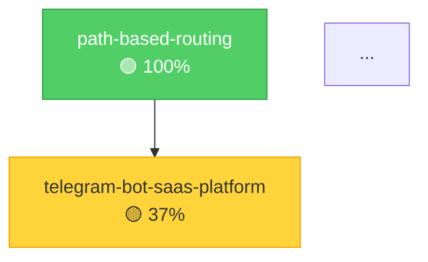

# Промпт: Синхронизация и оптимизация AI Agent Prompts (Production)

**Version:** 1.8
**Дата:** 2026-03-15
**Тип:** Operational (CI-ready)
**Назначение:** Ежедневная/по-требованию синхронизация системы `docs/ai-agent-prompts/` с единой точкой управления, нормализация каркасов и генерация Sync Report.

> **Отличие от meta-prompt:** `meta-promt-adr-system-generator.md` — **конституция** (определяет
> архитектуру, constraints C1-C8, стандартные блоки, per-prompt specs). Этот файл —
> **операционный аудитор** (Discovery → Coverage Matrix → Normalization → Validation →
> Sync Report). Не дублирует определения, а ссылается на meta-prompt и проверяет
> соответствие ему.

---

## Быстрый старт

| Параметр | Значение |
|----------|----------|
| **Тип промпта** | Operational (CI-ready) |
| **Время выполнения** | 30–60 мин |
| **Домен** | Аудит и синхронизация prompt-системы |

**Пример запроса:**

> «Используя `promt-sync-optimization.md`, выполни аудит синхронизации prompt-системы.
> Особо отметь промпты, не проходящие gates I (самодокументация) и J (индекс в README).
> Выдай Sync Report с gap, severity и списком файлов для исправления.»

**Ожидаемый результат:**
- Sync Report со статусами всех промптов (Sync Contract, Dual-Status, Topic Slug и т.д.)
- Матрица покрытия стандартных блоков по каждому файлу
- Список файлов с gap и severity (HIGH/MEDIUM/LOW)
- Очередь внедрения ADR по Critical Path

---

## Когда использовать

- После добавления новых промптов в систему (проверить соответствие gates)
- После массовых изменений в структуре или версиях промптов
- Раз в спринт (плановый аудит соответствия)
- При обнаружении системной рассинхронизации (термины, версии, структура)
- Перед release — для гарантии консистентности prompt-системы

> **Отличие от `promt-quality-test.md`:** sync-optimization проверяет **структуру и покрытие**
> обязательных блоков; quality-test проверяет **функциональное качество** output промптов.

---

## Mission Statement

Ты — системный архитектор AI-промптов проекта CodeShift.
Задача — синхронизировать, нормализовать и поддерживать в актуальном состоянии систему `docs/ai-agent-prompts/` **без дублирования**, с единой точкой управления и строгим соответствием архитектурным правилам проекта.

## Назначение

Этот промпт выполняет operational-синхронизацию prompt-системы CodeShift и формирует проверяемый Sync Report без дублирования.

## Контракт синхронизации системы

> Source of truth: [`meta-promt-adr-system-generator.md`](meta-promptness/meta-promt-adr-system-generator.md)
> При конфликте формулировок — приоритет всегда у meta-prompt.

---

## Входы

- Операционные и meta prompt-файлы из `docs/ai-agent-prompts/`
- Source of truth: `meta-promt-adr-system-generator.md`
- Результаты верификационных скриптов ADR

## Выходы

- Синхронизированные prompt-файлы без дублирования
- Матрица покрытия стандартных блоков и инвариантов
- Итоговый Sync Report в стандартизированном формате

## Ограничения / инварианты

- Следовать Constraints C1–C10 из `meta-promt-adr-system-generator.md`
- Обновлять файлы только in-place (без `*-v2.md`, `*-final.md`, `*-new.md`)
- Соблюдать Anti-Legacy и Diátaxis ограничения
- Не изменять read-only зоны: `docs/official_document/`, `.roo/`, `.env`

## Workflow шаги

1. Discovery: собрать актуальные файлы/версии/покрытие
2. Normalization: добавить недостающие стандартные блоки и инварианты
3. Validation: пройти quality gates и скриптовые проверки
4. Reporting: сформировать Sync Report и обновить реестр версий

## Проверки / acceptance criteria

- Все операционные промпты содержат обязательные стандартные блоки
- Все промпты содержат sync contract с ссылкой на meta-prompt
- Quality Gates A–G пройдены без нарушений

## Связи с другими промптами

- До: `meta-promptness/meta-promt-adr-system-generator.md`
- После: все операционные промпты и `README.md` в актуальном состоянии

---

## 0. Контекст проекта

> Полный Project Context, стек и архитектурные правила — см. **Блок 1** в
> [`meta-promt-adr-system-generator.md`](meta-promptness/meta-promt-adr-system-generator.md).

Краткая справка для CI-запуска:
- **CodeShift** — multi-tenant SaaS (Telegram Bot → YooKassa → K8s → VS Code).
- Deployment: **Helm + `config/manifests`** (не `k8s/`).
- ADR: **topic slug** only, dual-status, `verify-adr-checklist.sh`.
- Read-only: `docs/official_document/`, `.roo/`.

---

## 1. Единая точка управления (Single Control Point)

Источник истины prompt-системы:

```
docs/ai-agent-prompts/meta-promptness/meta-promt-adr-system-generator.md
```

Правила:
1. Любое изменение терминов/workflow/структуры/output-контрактов — **сначала** вносится в meta-prompt.
2. Затем — **синхронно** распространяется на все зависимые промпты.
3. В каждом операционном промпте — раздел «Контракт синхронизации системы» со ссылкой на meta-prompt.
4. При конфликте — meta-prompt имеет приоритет.

---

## 2. Текущее состояние (зафиксировать перед изменениями)

Перед любой синхронизацией:

### 2.1 Сканирование

```bash
# Операционные промпты
ls -1 docs/ai-agent-prompts/*.md | grep -v README

# Мета-промпты
ls -1 docs/ai-agent-prompts/meta-promptness/*.md | grep -v README

# Версии каждого промпта
for f in docs/ai-agent-prompts/*.md docs/ai-agent-prompts/meta-promptness/*.md; do
  [[ "$(basename "$f")" == "README.md" ]] && continue
  VER=$(grep -m1 -E '^\*\*(Версия|Version|Prompt Version)' "$f")
  echo "$(basename "$f"): $VER"
done
```

### 2.2 Реестр промптов (обновлено 2026-03-06)

| Файл | Версия | Тип | Статус |
|------|--------|-----|--------|
| `promt-verification.md` | 3.3 | Operational | ✅ |
| `promt-consolidation.md` | 2.4 | Operational | ✅ |
| `promt-index-update.md` | 2.4 | Operational | ✅ |
| `promt-feature-add.md` | 1.5 | Operational | ✅ |
| `promt-feature-remove.md` | 1.5 | Operational | ✅ |
| `promt-adr-template-migration.md` | 1.4 | Operational | ✅ |
| `promt-adr-implementation-planner.md` | 2.3 | Operational | ✅ |
| `promt-bug-fix.md` | 1.2 | Operational | ✅ |
| `promt-refactoring.md` | 1.2 | Operational | ✅ |
| `promt-security-audit.md` | 1.2 | Operational | ✅ |
| `promt-db-baseline-governance.md` | 1.2 | Operational | ✅ |
| `promt-ci-cd-pipeline.md` | 1.2 | Operational | ✅ |
| `promt-onboarding.md` | 1.2 | Operational | ✅ |
| `promt-sync-optimization.md` | 1.6 | Operational | ✅ |
| `promt-quality-test.md` | 1.2 | Operational | ✅ |
| `promt-versioning-policy.md` | 1.2 | Operational | ✅ |
| `promt-workflow-orchestration.md` | 1.2 | Operational | ✅ |
| `promt-sync-report-export.md` | 1.2 | Operational | ✅ |
| `promt-copilot-instructions-update.md` | 2.1 | Operational | ✅ |
| `promt-system-evolution.md` | 1.2 | Operational | ✅ |
| `promt-documentation-refactoring-standards-2026.md` | 1.2 | Operational | ✅ |
| `promt-documentation-quality-compression.md` | 1.1 | Operational | ✅ |
| `promt-mvp-baseline-generator-universal.md` | 1.3 | Operational | ✅ |
| `promt-project-adaptation.md` | 1.1 | Operational | ✅ |
| `promt-project-stack-dump.md` | 1.1 | Operational | ✅ |
| `promt-agent-init.md` | 1.0 | Operational | ✅ |
| `promt-readme-sync.md` | 1.0 | Operational | ✅ |
| `promt-project-rules-sync.md` | 1.1 | Operational | ✅ |
| `meta-promt-adr-system-generator.md` | 2.1 | Meta | ✅ |
| `meta-promt-prompt-generation.md` | 3.0 | Meta | ✅ |
| `meta-promt-adr-implementation-planner.md` | 2.1 | Meta | ✅ |
| `meta-promt-universal-prompt-generator.md` | 1.1 | Meta | ✅ |
| `meta-promt-sync-init-generator.md` | 1.0 | Meta | ✅ |

### 2.3 ADR index baseline

```bash
# Структурная верификация
./scripts/verify-all-adr.sh 2>&1 | tail -5

# Чеклист-прогресс по каждому ADR
./scripts/verify-adr-checklist.sh --format table

# Ключевые маркеры
echo "Active ADRs: $(ls docs/explanation/adr/ADR-[0-9]*.md | wc -l)"
echo "Deprecated:  $(ls docs/explanation/adr/deprecated/ADR-*.md 2>/dev/null | wc -l)"
```

### 2.4 Открытые GAP (из gap-analysis)

| GAP | Тема | Статус |
|-----|------|--------|
| 01–07 | Базовые промпты, dual-status, template, verification, consolidation, lifecycle, planner | ✅ Закрыты |
| 08 | QA — testing strategy prompt | 🔓 Открыт |
| 09 | Versioning — semantic versioning prompt-системы | 🔓 Открыт |
| 10 | Orchestration — prompt pipeline runner | 🔓 Открыт |
| 11 | Changelog automation | 🔓 Открыт |
| 12 | Prompt self-testing | 🔓 Открыт |
| 13 | Structural improvements | 🔓 Открыт |

---

## 3. Область синхронизации

Синхронизировать **все** промпты, обнаруженные в репозитории. Актуальный список (обновлено 2026-03-01):

**Операционные (28):**

| # | Файл | Категория |
|---|------|-----------|
| 1 | `promt-verification.md` | ADR core |
| 2 | `promt-consolidation.md` | ADR core |
| 3 | `promt-index-update.md` | ADR core |
| 4 | `promt-feature-add.md` | Lifecycle |
| 5 | `promt-feature-remove.md` | Lifecycle |
| 6 | `promt-adr-template-migration.md` | Migration |
| 7 | `promt-adr-implementation-planner.md` | Planning |
| 8 | `promt-bug-fix.md` | Dev workflow |
| 9 | `promt-refactoring.md` | Dev workflow |
| 10 | `promt-security-audit.md` | Security |
| 11 | `promt-db-baseline-governance.md` | Data |
| 12 | `promt-ci-cd-pipeline.md` | CI/CD |
| 13 | `promt-onboarding.md` | DevEx |
| 14 | `promt-sync-optimization.md` | Prompt governance |
| 15 | `promt-quality-test.md` | QA |
| 16 | `promt-versioning-policy.md` | Governance |
| 17 | `promt-workflow-orchestration.md` | Orchestration |
| 18 | `promt-sync-report-export.md` | Reporting |
| 19 | `promt-copilot-instructions-update.md` | Copilot policy |
| 20 | `promt-system-evolution.md` | System evolution |
| 21 | `promt-documentation-refactoring-standards-2026.md` | Docs governance |
| 22 | `promt-documentation-quality-compression.md` | Docs governance |
| 23 | `promt-mvp-baseline-generator-universal.md` | Planning |
| 24 | `promt-project-adaptation.md` | Discovery |
| 25 | `promt-project-stack-dump.md` | Discovery |
| 26 | `promt-agent-init.md` | Initialization |
| 27 | `promt-readme-sync.md` | Infra |
| 28 | `promt-project-rules-sync.md` | Infra |

**Мета-промпты (5):**

| # | Файл | Роль |
|---|------|------|
| M1 | `meta-promt-adr-system-generator.md` | Source of Truth |
| M2 | `meta-promt-prompt-generation.md` | Prompt Factory (CodeShift) |
| M3 | `meta-promt-adr-implementation-planner.md` | Planner Generator |
| M4 | `meta-promt-universal-prompt-generator.md` | Universal Generator |
| M5 | `meta-promt-sync-init-generator.md` | Sync/Init Generator |

> Если обнаружен новый промпт, не входящий в этот список — добавить его в отчёт с пометкой `NEW`.

---

## 4. Обязательные инварианты (нельзя нарушать)

> Полные определения с обоснованиями — **Constraints C1–C8** в
> [`meta-promt-adr-system-generator.md`](meta-promptness/meta-promt-adr-system-generator.md#constraints-обязательные-ограничения).

Здесь — компактный чек-лист для проверки при синхронизации:

| ID | Инвариант | Что проверять |
|----|-----------|---------------|
| C1 | **Dual-status ADR** | `## Статус решения` + `## Прогресс реализации` + `## Чеклист реализации` |
| C2 | **Topic slug = PK** | Нет хардкода номеров ADR |
| C3 | **Чеклист → прогресс** | `verify-adr-checklist.sh --topic <slug>` приоритетнее заявленного |
| C4 | **Верификация = код + чеклист + скрипт** | `verify-all-adr.sh` + `verify-adr-checklist.sh` |
| C5 | **Read-only зоны** | `docs/official_document/`, `.roo/`, `.env` |
| C6 | **Context7 gate** | В ADR-создающих промптах (`feature-add/remove`, `consolidation`, `migration`) |
| C7 | **Diátaxis** | `reference/` = AUTO-GENERATED only |
| C8 | **Anti-legacy** | Нет `PHASE_*.md`, `*_SUMMARY.md`, `*_REPORT.md`, `reports/`, `plans/` |
| C9 | **Update in-place** | Нет `*-v2.md`, `*-final.md`, `*-new.md` |
| C10 | **Sync Contract** | Каждый промпт → ссылка на `meta-promt-adr-system-generator.md` |
| C11 | **Topic slug-first** | Поиск ADR только по slug, номера нестабильны |
| C12 | **Context7 gate** | Обязателен для ADR-создающих промптов |
| C13 | **READ-ONLY docs/official_document** | Никогда не изменять |

---

## 5. Алгоритм синхронизации

### Шаг 1: Discovery (сбор данных)

```bash
# 1. Полный список промптов с версиями
for f in docs/ai-agent-prompts/*.md docs/ai-agent-prompts/meta-promptness/*.md; do
  [[ "$(basename "$f")" == "README.md" ]] && continue
  VER=$(grep -m1 -E '^\*\*(Версия|Version|Prompt Version)' "$f" | sed 's/.*: *//')
  echo "$(basename "$f") | $VER"
done

# 2. Матрица покрытия стандартных блоков
echo "=== Dual-status ==="
grep -rlE 'dual.status|двойной статус|Двойной статус' docs/ai-agent-prompts/*.md | xargs -I{} basename {}

echo "=== Topic slug ==="
grep -rl 'topic.slug\|Topic slug' docs/ai-agent-prompts/*.md | xargs -I{} basename {}

echo "=== verify-adr-checklist ==="
grep -rl 'verify-adr-checklist' docs/ai-agent-prompts/*.md | xargs -I{} basename {}

echo "=== Context7 ==="
grep -rl 'Context7' docs/ai-agent-prompts/*.md | xargs -I{} basename {}

echo "=== Anti-Legacy ==="
grep -rlE 'Anti-Legacy|anti-legacy|PHASE_|_REPORT\.md' docs/ai-agent-prompts/*.md | xargs -I{} basename {}

echo "=== Sync Contract ==="
grep -rl 'meta-promt-adr-system-generator\|source of truth\|Single Control Point' docs/ai-agent-prompts/*.md | xargs -I{} basename {}

# 3. ADR baseline
./scripts/verify-all-adr.sh 2>&1 | tail -3
./scripts/verify-adr-checklist.sh --summary
```

**Результат:** таблица `{prompt_file, version, блоки: [dual-status, topic-slug, checklist-ref, context7, anti-legacy, sync-contract]}` с ✅/❌ по каждому столбцу.

### Шаг 2: Normalization (приведение к каркасу)

Каждый операционный промпт **должен** содержать блоки:

| # | Обязательный блок | Описание |
|---|-------------------|----------|
| 1 | Назначение | Одно предложение: что делает промпт |
| 2 | Контракт синхронизации | Ссылка на meta-prompt |
| 3 | Входы | Что принимает (файлы, параметры) |
| 4 | Выходы | Что генерирует (файлы, отчёт, diff) |
| 5 | Ограничения / инварианты | Ссылки на I-1..I-9 |
| 6 | Workflow шаги | Пронумерованные действия |
| 7 | Проверки / acceptance criteria | Чеклист «промпт считается завершённым, когда…» |
| 8 | Связи с другими промптами | Workflow chain (что вызвать до/после) |

Для каждого промпта с ❌ в матрице покрытия — **добавить** недостающие стандартные блоки.

> **ВАЖНО:** Сохранять уникальный контент каждого промпта. Нормализация добавляет/обновляет стандартные блоки, но не удаляет специфичные инструкции.

### Шаг 3: Dependency / Queue logic

Построить **очередь внедрения ADR**:

1. Прочитать текущий `docs/explanation/adr/index.md` — Mermaid-граф зависимостей.
2. Для каждого ADR получить:
   - `## Статус решения`
   - Реальный прогресс: `./scripts/verify-adr-checklist.sh --topic <slug> --format short`
3. Классифицировать по слоям:
   - **Layer 0:** Инфраструктура (path-based-routing, k8s-provider-abstraction, storage-provider-selection)
   - **Layer 1:** Платформа (code-server-deployment, telegram-bot-saas-platform)
   - **Layer 2:** Сервисы (postgresql, redis, nextcloud)
   - **Layer 3:** Безопасность/SSL (certificate-management, ssl-automation)
   - **Layer 4:** Интеграция (ci-cd, gitops, monitoring)
   - **Layer 5:** Документация (documentation-generation)
4. Построить Critical Path: ADR с `Proposed` или `🟡 Частично` → по слоям от 0 к 5.
5. Определить блокировки: ADR, зависящий от не-реализованного ADR → blocked.
6. Использовать **topic slug** (не номера) для идентификации.

### Шаг 4: Validation (проверка целостности)

```bash
# 1. Все промпты ссылаются на meta-prompt
for f in docs/ai-agent-prompts/*.md; do
  [[ "$(basename "$f")" == "README.md" ]] && continue
  grep -q 'meta-promt-adr-system-generator' "$f" \
    && echo "✅ $(basename $f)" || echo "❌ $(basename $f) — MISSING sync contract"
done

# 2. Dual-status в ADR-ориентированных промптах
for f in docs/ai-agent-prompts/{verification,consolidation,index-update,feature-add,feature-remove,adr-template-migration,adr-implementation-planner}-prompt.md; do
  grep -qiE 'dual.status|двойной статус|Прогресс реализации' "$f" \
    && echo "✅ $(basename $f)" || echo "❌ $(basename $f) — MISSING dual-status"
done

# 3. ADR-template содержит dual-status
grep -q '## Статус решения' docs/explanation/adr/ADR-template.md \
  && grep -q '## Прогресс реализации' docs/explanation/adr/ADR-template.md \
  && echo "✅ ADR-template OK" || echo "❌ ADR-template BROKEN"

# 4. Скрипты верификации доступны
[ -x scripts/verify-adr-checklist.sh ] && echo "✅ checklist parser" || echo "❌ checklist parser MISSING"
[ -x scripts/verify-all-adr.sh ] && echo "✅ structural verifier" || echo "❌ structural verifier MISSING"

# 5. Нет legacy-ссылок как active source
grep -rnE 'k8s/(postgres|code-server|traefik).*\.(yaml|yml)' docs/ai-agent-prompts/*.md \
  | grep -v 'legacy\|исторический\|deprecated' \
  && echo "❌ Active legacy references found" || echo "✅ No active legacy references"

# 6. Anti-legacy compliance
for f in docs/ai-agent-prompts/*.md; do
  [[ "$(basename "$f")" == "README.md" ]] && continue
  basename "$f" | grep -qE 'PHASE_|_SUMMARY|_REPORT|_STATUS|_COMPLETE' \
    && echo "❌ $(basename $f) — anti-legacy filename violation"
done
echo "✅ Filename anti-legacy check passed"
```

### Шаг 5: Sync Report (формирование отчёта)

Сформировать отчёт в формате, указанном в разделе «Формат выхода».

---

## 6. Формат выхода (строго)

### 6.1 Сводка синхронизации

```markdown
## Sync Report — YYYY-MM-DD

**Промптов просканировано:** N
**Обновлено:** N файлов
**Без изменений:** N файлов
**Новых файлов:** N (если обнаружены)
```

### 6.2 Таблица промптов

```markdown
| Файл | Версия до | Версия после | Ключевые изменения |
|------|-----------|-------------|-------------------|
| promt-verification.md | 3.0 | 3.0 | Без изменений |
| promt-bug-fix.md | 1.0 | 1.1 | +dual-status, +anti-legacy |
| … | … | … | … |
```

### 6.3 Матрица покрытия стандартных блоков

```markdown
| Файл | Sync Contract | Dual-Status | Topic Slug | Checklist Ref | Context7 | Anti-Legacy |
|------|:---:|:---:|:---:|:---:|:---:|:---:|
| promt-verification.md | ✅ | ✅ | ✅ | ✅ | ✅ | ✅ |
| promt-onboarding.md | ✅ | ❌→✅ | ✅ | ❌→✅ | — | ❌→✅ |
| … | … | … | … | … | … | … |
```

> `—` означает «не применимо» (Context7 обязателен только для ADR-создающих промптов).

### 6.4 Очередь внедрения ADR

```markdown
### Очередь внедрения ADR (Critical Path + Layers)

| # | Topic Slug | Слой | Прогресс | Зависит от | Статус внедрения |
|---|-----------|------|----------|------------|-----------------|
| 1 | path-based-routing | L0 | 🟢 100% | — | ✅ Completed |
| 2 | telegram-bot-saas-platform | L1 | 🟡 37% | path-based-routing | ⚠️ In Progress |
| … | … | … | … | …| … |
```

### 6.5 Mermaid dependency graph (обновлённый)

```markdown

```

### 6.6 Таблица прогресса

```markdown
| Статус | Количество ADR | Topic Slugs |
|--------|---------------|-------------|
| ✅ Completed | N | slug1, slug2, … |
| ⚠️ In Progress | N | slug3, slug4, … |
| 📋 Planned | N | slug5, … |
| 🚫 Blocked | N | slug6, … |
| ⏳ Proposed | N | slug7, … |
```

### 6.7 Риски и меры

```markdown
| Уровень | Риск | Мера |
|---------|------|------|
| 🔴 High | … | … |
| 🟡 Medium | … | … |
| 🟢 Low | … | … |
```

### 6.8 Чек самоконтроля

```markdown
### Самоконтроль

- [ ] Dual-status соблюдён во всех ADR-ориентированных промптах
- [ ] Topic slug-first во всех промптах
- [ ] Scripts (`verify-adr-checklist.sh`, `verify-all-adr.sh`) используются
- [ ] Anti-legacy: нет запрещённых файлов/каталогов
- [ ] Context7 gate в ADR-создающих промптах
- [ ] Read-only зоны не затронуты
- [ ] Все промпты содержат Sync Contract
- [ ] Версии обновлены в промптах и README
```

---

## 7. Quality Gates (обязательно пройти)

| Gate | Описание | Проверка |
|------|----------|----------|
| **A** | Нет противоречий между промптами и meta-prompt | Термины/workflow/инварианты совпадают |
| **B** | Все ADR-ориентированные промпты учитывают dual-status + checklist parser | `grep -l` по ключевым маркерам |
| **C** | Нет ссылок на legacy-контур как active source | `grep -rn` по `k8s/*.yaml` без `legacy` контекста |
| **D** | Нет ручного редактирования reference-документов | `docs/reference/` = AUTO-GENERATED only |
| **E** | Обновления только in-place, без дублирования файлов | Нет `*-v2.md`, `*-final.md`, `*-new.md` |
| **F** | Каждый операционный промпт содержит Sync Contract | `grep -q 'meta-promt-adr-system-generator'` |
| **G** | Версии промптов обновлены | Проверить `Version:` / `Версия:` в шапке |

---

## 8. Критерий завершения

Работа завершена **только когда**:

1. ✅ Все найденные промпты синхронизированы с meta-prompt (Sync Contract + стандартные блоки).
2. ✅ Матрица покрытия стандартных блоков — **все ✅** (или обоснованные `—`).
3. ✅ Очередь внедрения ADR построена по Critical Path + Layers.
4. ✅ Mermaid-граф обновлён с актуальным прогрессом.
5. ✅ Формат выхода соблюдён полностью (разделы 6.1–6.8).
6. ✅ Quality Gates A–G пройдены.
7. ✅ Нет нарушений project rules / anti-legacy / read-only.
8. ✅ `README.md` обновлён (версии промптов в реестре, если изменились).

---

## Чеклист синхронизации

### Перед синхронизацией
- [ ] Прочитан `meta-promt-adr-system-generator.md` (source of truth)
- [ ] Получен baseline: версии промптов, покрытие блоков, GAP-список
- [ ] `./scripts/verify-all-adr.sh --quick` выполнен без ошибок

### В процессе
- [ ] Каждый промпт содержит `## Контракт синхронизации системы`
- [ ] Каждый промпт содержит `## Mission Statement` или эквивалент
- [ ] Каждый промпт содержит `## Связанные промпты` (таблица)
- [ ] Каждый промпт содержит `## Чеклист`
- [ ] Обновления делаются только in-place (без `*-v2.md` и пр.)
- [ ] Context7 использован для best practices

### Валидация (Gates A–G)
- [ ] Gate A: Канонический скелет соблюдён
- [ ] Gate B: Source of truth совместимость
- [ ] Gate C: Dual-status учтён (где применимо)
- [ ] Gate D: Topic slug-first (нет hardcoded номеров ADR)
- [ ] Gate E: Anti-legacy (нет активных ссылок на `k8s/`)
- [ ] Gate F: Read-only зоны не изменены
- [ ] Gate G: Версии обновлены консистентно

### Отчётность
- [ ] Sync Report сформирован (разделы 6.1–6.8)
- [ ] `README.md` обновлён с новыми версиями промптов
- [ ] `./scripts/check-prompt-drift.sh` прошёл без критических ошибок

---

## Связанные промпты

| Промпт | Когда использовать |
|--------|-------------------|
| `meta-promptness/meta-promt-adr-system-generator.md` | Source of truth (запускать первым) |
| `promt-verification.md` | После синхронизации — полная верификация ADR |
| `promt-index-update.md` | Если затронуты ADR — обновить `index.md` |
| `promt-quality-test.md` | QA-проверка промптов после синхронизации |

---

## Ресурсы

> Полная таблица ресурсов (Блок 5) — в [`meta-promt-adr-system-generator.md`](meta-promptness/meta-promt-adr-system-generator.md).

Ключевые для этого промпта:

| Ресурс | Путь |
|--------|------|
| Meta-prompt (source of truth) | `docs/ai-agent-prompts/meta-promptness/meta-promt-adr-system-generator.md` |
| Prompt Factory | `docs/ai-agent-prompts/meta-promptness/meta-promt-prompt-generation.md` |
| Верификация (структурная) | `scripts/verify-all-adr.sh` |
| Чеклист-парсер | `scripts/verify-adr-checklist.sh` |
| ADR Index | `docs/explanation/adr/index.md` |
| Gap Analysis | `docs/explanation/ai-prompt-system-gap-analysis.md` |
| Project rules | `.github/copilot-instructions.md` |

---

## Журнал изменений

| Версия | Дата | Изменения |
|--------|------|-----------|
| 1.8 | 2026-03-15 | Sync audit: 33 prompts, Gates A-F passed, C14-C16 NOT implemented (registry.yaml, test-prompts.sh, YAML frontmatter). ADR progress: 20 ✅, 3 🟡. |
| 1.7 | 2026-03-13 | Выпущена после синхронизации с meta-promt-adr-system-generator v2.3. |
| 1.6 | 2026-03-06 | Добавлены секции Gate I: `## Быстрый старт`, `## Когда использовать`, `## Журнал изменений`. Обновлён внутренний реестр (секции 2.2 и 3) до актуального состава 33 файлов. |
| 1.5 | 2026-02-25 | Production release: Discovery → Coverage Matrix → Normalization → Validation → Sync Report. Quality Gates A–G. |
| 1.4 | 2026-02-24 | Добавлены Gap 08–13, секция «Связанные промпты». |

---

**Prompt Version:** 1.8
**Maintainer:** @perovskikh
**Related:** `meta-promt-adr-system-generator.md` (конституция), `README.md`, все операционные промпты
