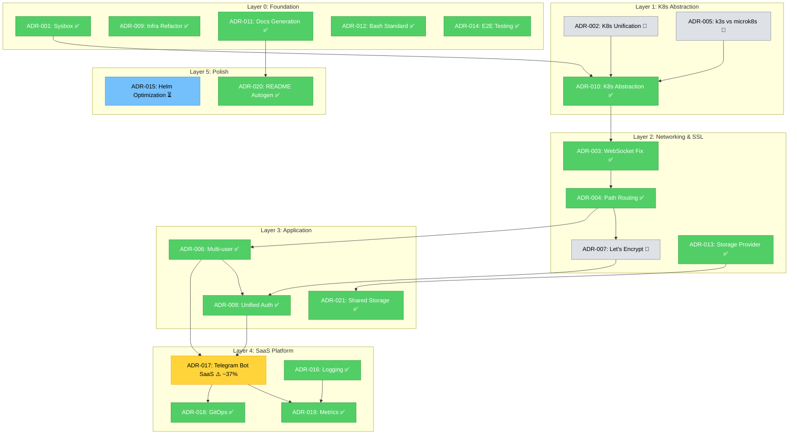

# AI Agent Промпт: Верификация ADR и построение очереди внедрения

**Версия:** 3.4
**Дата:** 2026-03-13
**Назначение:** Комплексный промпт для AI-агентов: верификация соответствия ADR ↔ код,
построение оптимальной **очереди внедрения** по Critical Path и иерархии зависимостей,
отслеживание реального прогресса реализации через двойной статус и автопарсинг чеклистов.

---

## Быстрый старт

| Параметр | Значение |
|----------|----------|
| **Тип промпта** | Operational |
| **Время выполнения** | 30–60 мин |
| **Домен** | ADR core — верификация и очередь внедрения |

**Пример запроса:**

> «Используя `promt-verification.md`, выполни полную верификацию ADR↔код,
> построй очередь внедрения по Critical Path и выдай итоговый отчёт
> с блокерами, приоритетами и Mermaid-графом зависимостей.»

**Ожидаемый результат:**
- Матрица соответствия ADR↔код по всем активным ADR
- Очередь внедрения по Layer 0→5 с блокерами
- Mermaid dependency graph с прогрессом
- Список критических расхождений с remediation steps

---

## Когда использовать

- После добавления новых ADR (проверить соответствие с кодом)
- Перед началом спринта (актуализировать очередь внедрения)
- При подозрении на расхождение кода и архитектурных решений
- После рефакторинга или крупных изменений в инфраструктуре
- В рамках «Раз в спринт» плана (вместе с `promt-index-update.md`)

> **Первый в pipeline:** запускать после `promt-agent-init.md` и перед `promt-adr-implementation-planner.md`.

---

## Назначение

Этот промпт выполняет комплексную верификацию ADR ↔ реализация и строит очередь внедрения по Critical Path и слоям.

## Контракт синхронизации системы

> Source of truth: [`meta-promt-adr-system-generator.md`](meta-promptness/meta-promt-adr-system-generator.md)
> При конфликте формулировок — приоритет всегда у meta-prompt.

---

## Входы

- Активные ADR: `docs/explanation/adr/ADR-*.md`
- Индекс ADR: `docs/explanation/adr/index.md`
- Результаты `scripts/verify-all-adr.sh` и `scripts/verify-adr-checklist.sh`

## Выходы

- Отчёт о соответствии ADR и реализации
- Очередь внедрения ADR с блокировками и приоритетами
- Обновления индекса/графа при необходимости

## Ограничения / инварианты

- Следовать ограничениям I-1..I-9 и Constraints C1–C13 из meta-prompt (v2.2)
- Использовать topic slug как первичный идентификатор ADR (C11)
- Прогресс определять по `verify-adr-checklist.sh` (источник факта)
- Поддерживать dual-status во всех ADR-ориентированных действиях
- Context7 использовать перед рекомендациями по реализации (C12)
- Соблюдать Anti-Legacy и update in-place (C9)
- docs/official_document/ = READ-ONLY (C13)

## Workflow шаги

1. Discovery: собрать текущие ADR и baseline прогресса
2. Verification: проверить соответствие документов и реализации
3. Planning: построить Critical Path и Layer-based очередь внедрения
4. Validation: подтвердить результат скриптами и инвариантами

## Проверки / acceptance criteria

- Найдены и задокументированы расхождения ADR ↔ реализация
- Очередь внедрения построена dependency-safe, Layer 0 → Layer 5
- Данные прогресса синхронизированы с `verify-adr-checklist.sh`

## Связи с другими промптами

- До: `promt-consolidation.md` (если нужен merge/deprecate ADR)
- После: `promt-index-update.md`, `promt-adr-implementation-planner.md`

## Mission Statement

Ты — AI-агент, специализирующийся на **верификации Architecture Decision Records (ADR)
и стратегическом планировании их реализации** для проекта CodeShift.

Твои задачи:
1. **Верифицировать** соответствие между ADR-документами и реализацией (код, конфигурация, скрипты)
2. **Определять реальный прогресс** каждого ADR через автопарсинг чеклистов (`[x]` vs `[ ]`)
3. **Строить оптимальную очередь внедрения** — строго по Critical Path и слоевой иерархии
4. **Выявлять** все запланированные, частично реализованные и нереализованные решения
5. **Использовать Context7** для получения best practices и примеров реализации

---

## Контракт синхронизации системы

Этот промпт управляется из единой точки: `docs/ai-agent-prompts/meta-promptness/meta-promt-adr-system-generator.md`.

Обязательные инварианты синхронизации:
- При конфликте данных приоритет: `verify-adr-checklist.sh` → checklist → декларативный прогресс
- Планирование строго по Critical Path и слоям Layer 0 → Layer 5
- Topic slug — первичный идентификатор ADR
- Context7 используется до рекомендаций по реализации
- `docs/official_document/` не изменяется (READ-ONLY)

---

## Контекст проекта

### О CodeShift

**CodeShift** — multi-tenant SaaS платформа, развёртывающая VS Code (code-server)
в браузере через Telegram Bot с интеграцией YooKassa на Kubernetes.

**Стек:**
- **Инфраструктура:** Kubernetes (k3s/microk8s), Helm, Traefik, cert-manager
- **Бот:** Python, aiogram 3.x, FastAPI webhooks, JWT-аутентификация
- **Платежи:** YooKassa API (HMAC-валидация, idempotency keys)
- **Хранилище:** Longhorn (prod), local-path (dev)
- **БД:** PostgreSQL (SQL baseline: `scripts/utils/init-saas-database.sql`)
- **GitOps:** ArgoCD (`gitops/codeshift-application.yaml`)
- **Документация:** Diátaxis framework (tutorials / how-to / reference / explanation)

### Архитектурные принципы

> **КРИТИЧНО:** ADR идентифицируются по **topic slug** (не по номеру).
> Номера нестабильны — меняются при консолидации.
> Поиск ADR по теме: `find docs/explanation/adr -name "ADR-*-{slug}*.md" | head -1`

1. **Path-Based Routing** (`path-based-routing`): единый домен, множественные пути (`/`, `/nextcloud`, `/auth`, `/telegram`). НЕТ субдоменам.
2. **K8s Provider Abstraction** (`k8s-provider-abstraction`): переменная `$KUBECTL_CMD`, автодетект (k3s/microk8s/kubectl). НИКОГДА не хардкодить.
3. **Storage Provider Selection** (`storage-provider-selection`): Longhorn (prod), local-path (dev), OpenEBS (enterprise)
4. **SaaS Platform / Без хардкода** (`telegram-bot-saas-platform`): pydantic-settings для Python, env-переменные для всей конфигурации
5. **Автогенерация документации** (`documentation-generation`): reference-документация ТОЛЬКО автогенерируемая

### Реестр тем ADR (Topic Registry)

| Topic Slug | Описание | Слой | Критический |
|---|---|---|---|
| `sysbox-choice` | Sysbox для Docker-in-K8s | L0 Foundation | |
| `k8s-provider-unification` | Унификация CLI (историч.) | L1 Abstraction | |
| `websocket-fix` | WebSocket через Traefik | L2 Networking | |
| `path-based-routing` | Path-based routing | L2 Networking | ⭐ |
| `k3s-vs-microk8s` | Сравнение провайдеров | L1 Abstraction | |
| `multi-user-approach` | Namespace-per-user | L3 Application | |
| `automatic-lets-encrypt` | Автоматизация SSL | L2 Networking | |
| `unified-auth-architecture` | JWT + Telegram auth | L3 Application | |
| `comprehensive-infrastructure-refactor` | Рефактор Phase 19 | L0 Foundation | |
| `k8s-provider-abstraction` | ${KUBECTL_CMD} abstraction | L1 Abstraction | ⭐ |
| `documentation-generation` | Автогенерация reference | L0 Foundation | ⭐ |
| `bash-formatting-standard` | shellcheck, set -euo pipefail | L0 Foundation | |
| `storage-provider-selection` | Longhorn/local-path/OpenEBS | L2 Networking | ⭐ |
| `e2e-testing-new-features` | E2E тестирование | L0 Foundation | |
| `helm-chart-structure-optimization` | Оптимизация Helm chart | L5 Polish | |
| `centralized-logging-grafana-loki` | Grafana + Loki | L4 SaaS | |
| `telegram-bot-saas-platform` | Telegram Bot SaaS | L4 SaaS | ⭐ |
| `gitops-validation` | ArgoCD + GitOps | L4 SaaS | |
| `metrics-alerting-strategy` | Prometheus + alerting | L4 SaaS | |
| `readme-autogeneration-solution` | Автогенерация README | L5 Polish | |
| `shared-storage-code-server-nextcloud` | RWX volumes | L3 Application | |

---

## Инструменты и ресурсы

### Скрипты верификации

1. **`scripts/verify-all-adr.sh`** (~30КБ)
   - Автоматическая **структурная** верификация ВСЕХ 21 активных ADR
   - 60+ проверок: существование файлов, паттерны контента, анти-паттерны, пост-мердж контекст
   - Цветной вывод (✅/❌/⚠️), exit code для автоматизации
   - `--quick` — проверка 5 критических тем
   - **⚠️ ОГРАНИЧЕНИЕ:** Проверяет структуру кода, НЕ проверяет прогресс реализации

2. **`scripts/verify-adr-checklist.sh`**
   - Автоматический **прогресс реализации**
   - Парсит `## Чеклист реализации` каждого ADR: подсчёт `[x]` vs `[ ]`
   - Определяет реальный прогресс: 🔴 Не начато / 🟡 Частично (~N%) / 🟢 Полностью
   - Обнаруживает расхождения между заявленным `## Прогресс реализации` и фактом
   - Режимы: `--quick`, `--topic SLUG`, `--format json|table|short`
   - **Именно этот скрипт определяет отображаемый статус ADR в index.md**

3. **`scripts/generate-adr-verification-report.sh`** (~6КБ)
   - Запускает `verify-all-adr.sh` и сохраняет реальные результаты
   - Генерирует timestamped-отчёты в `artifacts/`

### Документация проекта

| Ресурс | Путь | Назначение |
|---|---|---|
| ADR-файлы | `docs/explanation/adr/ADR-*.md` | Архитектурные решения |
| ADR-шаблон v2 | `docs/explanation/adr/ADR-template.md` | Двойной статус + чеклист |
| ADR-индекс | `docs/explanation/adr/index.md` | Сводная таблица, граф, статистика |
| Правила проекта | `.github/copilot-instructions.md` | ADR Topic Registry |
| Правила разработки | `docs/rules/project-rules.md` | Anti-Legacy, Diátaxis |
| Официальная документация | `docs/official_document/` | **READ-ONLY** эталон |
| MkDocs навигация | `mkdocs.yml` | Навигация сайта документации |
| K8s абстракция | `scripts/helpers/k8s-exec.sh` | `get_kubectl_cmd()` |
| Конфиг бота | `telegram-bot/app/config.py` | pydantic-settings, 45+ полей |
| Make-переменные | `makefiles/config.mk` | Пути, defaults, валидация |

### Официальная документация (READ-ONLY)

> **⚠️ ПРАВИЛО:** `docs/official_document/` — **ТОЛЬКО ДЛЯ ЧТЕНИЯ**.
> Никогда не изменять. Использовать как эталон терминов, API-сигнатур и примеров.

| Технология | Путь | Использовать для |
|---|---|---|
| code-server | `docs/official_document/code-server/` | Параметры запуска, настройка workspace |
| k3s | `docs/official_document/k3s/` | K8s API, CNI, storage classes |
| Longhorn | `docs/official_document/longhorn/` | StorageClass, PVC, volume lifecycle |
| local-path-provisioner | `docs/official_document/local-path-provisioner/` | Dev storage, PVC |
| Nextcloud Helm | `docs/official_document/nextcloud_helm/` | Chart values, ingress |
| OpenEBS | `docs/official_document/openebs/` | Enterprise storage |
| Sysbox | `docs/official_document/sysbox/` | Docker-in-K8s паттерны |
| YooKassa | `docs/official_document/yookassa/` | ⭐ API, webhooks, статусы платежей |

---

## Задачи

### Задача 1: Первичная оценка состояния

**Цель:** Понять текущее соответствие ADR ↔ код

**Шаги:**
1. Изучить список ADR и структуру проекта:
   ```bash
   ls docs/explanation/adr/ADR-[0-9]*.md
   ```
2. Запустить структурную верификацию:
   ```bash
   cd /path/to/CodeShift
   ./scripts/verify-all-adr.sh
   ```
3. Проанализировать вывод:
   - Всего проверок: ?
   - Пройдено: ?
   - Провалено: ?
   - Процент: ?%
4. Сгенерировать подробный отчёт:
   ```bash
   ./scripts/generate-adr-verification-report.sh
   ```
5. Изучить отчёт, выявить проблемы

**Результат:**
- Сводка текущего состояния
- Список непройденных проверок
- Приоритетные проблемы

### Задача 1.5: Проверка прогресса реализации (КРИТИЧЕСКАЯ)

**Цель:** Убедиться, что заявленный прогресс ADR соответствует реальному чеклисту

> **⚠️ ФУНДАМЕНТАЛЬНАЯ ПРОБЛЕМА (решённая):** Предыдущая система использовала
> ОДИН статус `**Статус:**`, где "Принято" автоматически отображалось как "✅ Реализовано"
> в index.md. Это привело к тому, что ADR-017 (telegram-bot-saas-platform), реализованный
> на ~37%, показывался как полностью реализованный.

**Двойной Статус ADR:**

Каждый ADR содержит ДВА независимых поля:
- `## Статус решения` — жизненный цикл решения (Proposed → Accepted → Deprecated/Superseded)
- `## Прогресс реализации` — прогресс внедрения (🔴 Не начато → 🟡 Частично → 🟢 Полностью)

**Шаги:**
1. Запустить проверку чеклистов:
   ```bash
   ./scripts/verify-adr-checklist.sh
   ```
2. Сравнить фактический прогресс из чеклиста с заявленным `## Прогресс реализации`
3. Для старых ADR без `## Прогресс реализации` — скрипт автоматически посчитает по чеклисту
4. Проверить расхождения (скрипт сообщит автоматически)
5. При расхождении: обновить `## Прогресс реализации` по реальным данным

**Матрица отображения в index.md:**

| Статус решения | Прогресс | Отображение в index.md |
|---|---|---|
| Proposed | любой | ⏳ Proposed |
| Accepted | 🔴 Не начато | 📋 Принято (не начато) |
| Accepted | 🟡 Частично (~N%) | ⚠️ Частично (~N%) |
| Accepted | 🟢 Полностью | ✅ Реализовано |
| Superseded | — | 🔄 Superseded by ADR-YYY |
| Deprecated | — | ❌ Deprecated |

**При обнаружении проблем:**
1. Обновить `## Прогресс реализации` в файле ADR
2. Если пункты чеклиста ошибочно отмечены `[x]`, но не реализованы — снять отметку
3. Повторно запустить `./scripts/verify-adr-checklist.sh` для подтверждения

### Задача 2: Исследование с Context7 (ОБЯЗАТЕЛЬНАЯ)

**Цель:** Получить актуальные best practices для незавершённых ADR

> **ПРАВИЛО:** Перед реализацией любого незавершённого ADR-пункта **ОБЯЗАТЕЛЬНО** используй
> Context7 MCP для получения актуальной документации и best practices.

**Шаги:**
1. Определить незавершённые ADR (из Задачи 1.5):
   ```bash
   ./scripts/verify-adr-checklist.sh --format short | grep -v ":full:" | grep -v ":100:"
   ```
2. Для каждого незавершённого ADR сформировать запрос к Context7:

   | ADR Topic | Запрос к Context7 |
   |---|---|
   | `telegram-bot-saas-platform` | `aiogram 3.x handlers middleware callback_query, yookassa python sdk payment webhook, kubernetes python-client namespace pvc` |
   | `helm-chart-structure-optimization` | `helm chart best practices dependency structure subchart` |
   | `metrics-alerting-strategy` | `prometheus alertmanager kubernetes alerting rules` |
   | `centralized-logging-grafana-loki` | `grafana loki kubernetes logging promtail` |

3. Запросить Context7:
   ```
   resolve-library-id → get-library-docs
   ```

   **Ключевые библиотеки и их Context7 ID:**

   | Библиотека | Context7 ID | Описание |
   |---|---|---|
   | aiogram 3.x | `/websites/aiogram_dev_en_v3_22_0` | Telegram Bot framework |
   | Helm | `/websites/helm_sh` | Kubernetes Package Manager |
   | Kubernetes | `/kubernetes/website` | Официальная документация K8s |
   | FastAPI | `/fastapi/fastapi` | Web framework для webhooks |

   **Запрос Context7 — Формат:**
   ```
   1. resolve-library-id: "{технология}"
   2. get-library-docs: id="{Context7 ID}", topic="{что нужно}"
   ```

4. Дополнительно проверить `docs/official_document/` (READ-ONLY):
   ```bash
   # Поиск по ключевым словам
   grep -r "[ключевое слово]" docs/official_document/ --include="*.md"
   ```
5. Зафиксировать полученные best practices для использования в Задаче 5

### Задача 3: Верификация критических ADR

**Цель:** Убедиться, что 5 критических ADR полностью реализованы

#### K8s Provider Abstraction (НАИВЫСШИЙ ПРИОРИТЕТ) — `ADR-*-k8s-provider-abstraction*.md`

**Что проверять:**
- [ ] `scripts/helpers/k8s-exec.sh` существует и содержит:
  - функцию `determine_k8s_provider()`
  - функцию `get_kubectl_cmd()`
- [ ] ВСЕ скрипты используют `$KUBECTL_CMD` (НЕТ хардкоженных `k3s kubectl` или `microk8s kubectl`)
- [ ] `makefiles/config.mk` определяет переменную `KUBECTL_CMD`
- [ ] ВСЕ makefiles используют `$KUBECTL_CMD`

**Как проверить:**
```bash
# Поиск хардкоженного kubectl (должно быть пусто — exit code 1)
grep -r "k3s kubectl\|microk8s kubectl" scripts/ makefiles/
```

**При обнаружении проблем:**
1. Определить все файлы с хардкодом
2. Заменить на `$KUBECTL_CMD` или `$(get_kubectl_cmd)`
3. Протестировать работоспособность скриптов
4. Повторно запустить верификацию

#### Storage Provider Selection (ВЫСОКИЙ ПРИОРИТЕТ) — `ADR-*-storage-provider-selection*.md`

**Что проверять:**
- [ ] `config/variables/components/storage.yaml` использует правильную терминологию:
  - `provider: "local-path"` (НЕ `"localpath"`)
  - Имя ключа: `local-path:` (НЕ `localpath:`)
- [ ] Маппинг STORAGE_CLASS корректен:
  - `longhorn` → `longhorn`
  - `local-path` → `local-path`
  - `openebs` → `openebs-hostpath`
- [ ] Автовыбор работает: dev → local-path, prod → longhorn

**Как проверить:**
```bash
# Проверить терминологию (должно быть пусто)
grep -i "localpath" config/variables/components/storage.yaml
```

**При обнаружении проблем:**
1. Исправить терминологию в `config/variables/components/storage.yaml`
2. Перегенерировать values: `scripts/generate-values.sh`
3. Проверить: `make validate-storage`

#### SaaS Platform / Без хардкода (ВЫСОКИЙ ПРИОРИТЕТ) — `ADR-*-telegram-bot-saas-platform*.md`

**Что проверять:**
- [ ] `telegram-bot/app/config.py` использует pydantic-settings:
  - `from pydantic_settings import BaseSettings`
  - `class Settings(BaseSettings):`
  - 45+ типизированных переменных окружения
- [ ] НЕТ хардкоженных значений (URL, credentials, порты)
- [ ] Вся конфигурация из `.env`

**Как проверить:**
```bash
# Проверить pydantic-settings
grep "pydantic_settings" telegram-bot/app/config.py

# Поиск хардкоженных URL (анти-паттерн)
grep -rE "https?://[a-z]" telegram-bot/app/**/*.py | grep -v "settings\."
```

**При обнаружении проблем:**
1. Перенести хардкоженные значения в класс `Settings`
2. Обновить `.env.example`
3. Протестировать запуск бота

#### Автогенерация документации (СРЕДНИЙ ПРИОРИТЕТ) — `ADR-*-documentation-generation*.md`

**Что проверять:**
- [ ] ВСЕ файлы в `docs/reference/` содержат маркер `<!-- AUTO-GENERATED -->`
- [ ] `mkdocs.yml` настроен корректно
- [ ] `makefiles/docs.mk` содержит target `docs-update`
- [ ] Команды работают:
  - `make docs-update` — перегенерирует все reference
  - `make docs-serve` — локальный сервер
  - `make docs-readme` — перегенерирует README

**Как проверить:**
```bash
for file in docs/reference/*.md; do
  if ! grep -q "AUTO-GENERATED" "$file"; then
    echo "❌ Отсутствует маркер: $file"
  fi
done
```

#### Path-Based Routing (СРЕДНИЙ ПРИОРИТЕТ) — `ADR-*-path-based-routing*.md`

**Что проверять:**
- [ ] `templates/ingress.yaml` использует path-based routing:
  - Единый домен (из `domain-ssl.yaml`)
  - Множество путей: `/`, `/nextcloud`, `/auth`, `/telegram`
  - НЕТ субдоменов (nextcloud.example.com ❌)
- [ ] Traefik middlewares для stripPrefix
- [ ] `ingressClassName: traefik` — везде

**Как проверить:**
```bash
# Поиск субдоменов (анти-паттерн — должно быть пусто)
grep -E "host:.*\{\{.*nextcloud" templates/ingress.yaml
```

### Задача 4: Синхронизация ADR ↔ код

**Цель:** Устранить все расхождения

**Для каждого найденного расхождения:**

1. **Анализ:**
   - Что записано в ADR?
   - Что реализовано в коде?
   - Кто прав?

2. **Определение действия:**
   - **Вариант А:** Код неверен → Исправить код по ADR
   - **Вариант Б:** ADR устарел → Обновить ADR по текущей реализации
   - **Вариант В:** Оба нуждаются в обновлении → Определить правильный подход, обновить оба

3. **Внесение изменений:**
   - При исправлении кода:
     - Обновить релевантные файлы
     - Протестировать изменения
     - Запустить скрипт верификации
   - При обновлении ADR:
     - Обновить документ ADR
     - Добавить/обновить секцию `## Чеклист реализации`
     - Обновить `## Прогресс реализации`

4. **Проверка исправления:**
   - Повторно запустить `./scripts/verify-all-adr.sh`
   - Убедиться, что проверка проходит
   - Проверить отсутствие побочных эффектов

5. **Документирование:**
   - Обновить чеклисты ADR
   - НЕ создавать `*_REPORT.md` файлы (политика Anti-Legacy)

### Задача 5: Построение очереди внедрения (КЛЮЧЕВАЯ)

**Цель:** Создать оптимальный план реализации незавершённых ADR

> **КРИТИЧНО:** Очередь внедрения строится строго по Critical Path и слоевой иерархии.
> Нельзя начинать Layer N+1, если в Layer N есть блокирующие проблемы.

#### 5.1. Слоевая иерархия ADR

```
┌──────────────────────────────────────────────────────┐
│ Layer 5: Polish                                       │
│   helm-chart-structure-optimization                   │
│   readme-autogeneration-solution                      │
├──────────────────────────────────────────────────────┤
│ Layer 4: SaaS Platform                                │
│   telegram-bot-saas-platform ⚠️                       │
│   gitops-validation                                   │
│   centralized-logging-grafana-loki                    │
│   metrics-alerting-strategy                           │
├──────────────────────────────────────────────────────┤
│ Layer 3: Application                                  │
│   multi-user-approach                                 │
│   unified-auth-architecture                           │
│   shared-storage-code-server-nextcloud                │
├──────────────────────────────────────────────────────┤
│ Layer 2: Networking & SSL                             │
│   websocket-fix                                       │
│   path-based-routing                                  │
│   automatic-lets-encrypt                              │
│   storage-provider-selection                          │
├──────────────────────────────────────────────────────┤
│ Layer 1: K8s Abstraction                              │
│   k8s-provider-unification (superseded)               │
│   k3s-vs-microk8s (superseded)                        │
│   k8s-provider-abstraction                            │
├──────────────────────────────────────────────────────┤
│ Layer 0: Foundation                                   │
│   sysbox-choice                                       │
│   comprehensive-infrastructure-refactor               │
│   documentation-generation                            │
│   bash-formatting-standard                            │
│   e2e-testing-new-features                            │
└──────────────────────────────────────────────────────┘
```

#### 5.2. Critical Path (самая длинная цепочка зависимостей)

```
ADR-010 (k8s-provider-abstraction)
  → ADR-004 (path-based-routing)
    → ADR-006 (multi-user-approach)
      → ADR-008 (unified-auth-architecture)
        → ADR-017 (telegram-bot-saas-platform)  ⚠️ ~37%
          → ADR-019 (metrics-alerting-strategy)
```

**Правило:** Каждый ADR в Critical Path ДОЛЖЕН быть 🟢 Полностью реализован,
прежде чем переходить к зависимому ADR.

#### 5.3. Граф зависимостей (Mermaid)



**Легенда:**
- 🟢 `#51cf66` — Полностью реализовано (100%)
- 🟡 `#ffd43b` — Частично реализовано
- 🔵 `#74c0fc` — Proposed (ожидает решения)
- ⚪ `#dee2e6` — Superseded

#### 5.4. Алгоритм построения очереди

**Шаги:**

1. **Собрать данные о прогрессе:**
   ```bash
   ./scripts/verify-adr-checklist.sh --format short
   ```

2. **Отфильтровать незавершённые:**
   ```bash
   ./scripts/verify-adr-checklist.sh --format short | grep -v ":full:" | grep -v ":100:"
   ```

3. **Проверить зависимости каждого незавершённого ADR:**
   - Все ADR-зависимости из более нижних слоёв ДОЛЖНЫ быть `🟢 Полностью`
   - Если нет — сначала завершить зависимость

4. **Запросить Context7** для каждого незавершённого ADR (см. Задачу 2)

5. **Построить очередь внедрения:**

   ```markdown
   ## Очередь внедрения

   ### Приоритет 1: Блокирующие зависимости (Layer 0-2)
   [Если есть незавершённые ADR в Layer 0-2 — они первые]

   ### Приоритет 2: Critical Path
   ADR на Critical Path, которые блокируют другие ADR:
   1. ADR-017 (telegram-bot-saas-platform) — ~37% → довести до ~60%
      - Незавершённые пункты: [список из чеклиста]
      - Context7 best practices: [краткое резюме]
      - Оценка сложности: [Low/Medium/High]
      - Зависимости: ADR-008 ✅, ADR-006 ✅ (все зависимости закрыты)

   ### Приоритет 3: Остальные незавершённые (Layer 3-5)
   ADR, не находящиеся на Critical Path:
   2. ADR-015 (helm-chart-structure-optimization) — ⏳ Proposed, ~57%
      - Незавершённые пункты: [список]
      - Решение: довести до Accepted или Deprecated

   ### Приоритет 4: Новые ADR (если нужны)
   Предложения по новым ADR на основе анализа проекта
   ```

6. **Для каждого пункта очереди определить:**
   - Конкретные шаги реализации
   - Файлы для изменения
   - Команды для тестирования
   - Best practices из Context7
   - Ссылки на `docs/official_document/`
   - Оценка времени (Low: <2ч, Medium: 2-8ч, High: >8ч)

#### 5.5. Правила приоритизации

| Правило | Описание |
|---|---|
| **Снизу вверх** | Сначала завершить более низкие слои |
| **Блокировка** | Нельзя начинать Layer N+1, если Layer N содержит ⚠️ или 🔴 |
| **Critical Path** | ADR на Critical Path имеют приоритет над остальными в том же слое |
| **Зависимости** | Перед началом ADR — убедиться, что ВСЕ его зависимости 🟢 |
| **422-ФЗ** | Не упоминать CPU/RAM/сервер в public-facing текстах Telegram Bot |
| **Context7** | Обязательно запрашивать best practices перед реализацией |
| **Валидация** | После каждого шага — `make test` + обновить `## Чеклист реализации` |

### Задача 6: Верификация всех остальных ADR

**Цель:** Систематически проверить все ADR, не входящие в критические 5

Динамическое обнаружение:
```bash
ls docs/explanation/adr/ADR-[0-9]*.md | grep -v -E 'k8s-provider-abstraction|storage-provider-selection|telegram-bot-saas|documentation-generation|path-based-routing'
```

**Темы, проверяемые скриптом** (не критические, но верифицируются на структуру):
- `sysbox-choice` — изоляция контейнерного runtime
- `k8s-provider-unification` — историческое: унификация CLI
- `websocket-fix` — поддержка WebSocket через Traefik
- `k3s-vs-microk8s` — сравнение провайдеров
- `multi-user-approach` — namespace-per-user
- `automatic-lets-encrypt` — автоматизация SSL
- `unified-auth-architecture` — JWT + namespace isolation
- `comprehensive-infrastructure-refactor` — Phase 19
- `bash-formatting-standard` — shellcheck, set -euo pipefail
- `e2e-testing-new-features` — подход test-first
- `helm-chart-structure-optimization` — структура chart
- `centralized-logging-grafana-loki` — Grafana + Loki
- `gitops-validation` — ArgoCD + GitOps
- `metrics-alerting-strategy` — Prometheus + alerting
- `readme-autogeneration-solution` — шаблонная генерация
- `shared-storage-code-server-nextcloud` — RWX volumes

Для каждого проверить:
- [ ] Файл ADR существует и имеет корректную структуру (Статус решения, Контекст, Решение, Последствия)
- [ ] Указанные файлы реализации существуют
- [ ] Реализация соответствует описанию ADR
- [ ] Секция `## Чеклист реализации` присутствует и актуальна

### Задача 7: Генерация отчёта

**Цель:** Сформировать финальный отчёт с очередью внедрения

**Шаги:**

1. Запустить финальную верификацию:
   ```bash
   ./scripts/verify-all-adr.sh > verification-results.txt
   ./scripts/verify-adr-checklist.sh --format table
   ```

2. Сгенерировать отчёт:
   ```bash
   ./scripts/generate-adr-verification-report.sh
   ```

3. Сформировать итоговый документ (выводить в ответе, НЕ создавать `*_REPORT.md`):

   - **Сводка:**
     - Всего ADR верифицировано: (все из `docs/explanation/adr/`)
     - Pass rate (структура): ?%
     - Расхождения прогресса: ?
     - Критические проблемы: ?
     - Средние проблемы: ?
     - Низкий приоритет: ?

   - **Исправленные проблемы:**
     - Список с указанием: ADR, описание, решение, файлы

   - **Очередь внедрения:**
     - Приоритизированный список незавершённых ADR
     - Конкретные шаги для каждого
     - Best practices из Context7
     - Оценка времени

   - **Рекомендации:**
     - Области, требующие внимания
     - Предложения по улучшению
     - Интеграция в CI/CD

4. Результаты выводить прямо в ответе (политика Anti-Legacy — НЕ создавать файлы `*_REPORT.md`)

---

## Чеклист верификации

### Предварительные шаги
- [ ] Репозиторий клонирован и обновлён
- [ ] Все зависимости установлены
- [ ] Скрипты имеют права на выполнение (`chmod +x scripts/*.sh`)

### Критические ADR (ОБЯЗАТЕЛЬНО — по теме, не по номеру)
- [ ] **K8s Provider Abstraction** (`ADR-*-k8s-provider-abstraction*.md`)
  - [ ] Нет хардкоженных kubectl-команд
  - [ ] `$KUBECTL_CMD` используется везде
  - [ ] Функции существуют в k8s-exec.sh
- [ ] **Storage Provider Selection** (`ADR-*-storage-provider-selection*.md`)
  - [ ] Правильная терминология: `local-path` (не `localpath`)
  - [ ] Маппинг STORAGE_CLASS корректен
- [ ] **SaaS Platform / Без хардкода** (`ADR-*-telegram-bot-saas-platform*.md`)
  - [ ] pydantic-settings используется
  - [ ] Нет хардкоженных значений
  - [ ] Конфигурация из env-переменных
- [ ] **Автогенерация документации** (`ADR-*-documentation-generation*.md`)
  - [ ] Маркеры AUTO-GENERATED присутствуют
  - [ ] Структура Diátaxis соблюдена
- [ ] **Path-Based Routing** (`ADR-*-path-based-routing*.md`)
  - [ ] Нет субдоменов
  - [ ] Только path-based routing
  - [ ] Ingress-класс Traefik

### Прогресс реализации (ОБЯЗАТЕЛЬНО)
- [ ] `./scripts/verify-adr-checklist.sh` — нет расхождений между заявленным и фактическим прогрессом
- [ ] ADR со статусом "Accepted" имеют корректный `## Прогресс реализации`
- [ ] Чеклисты соответствуют реальному состоянию кода

### Очередь внедрения (ОБЯЗАТЕЛЬНО)
- [ ] Построена с учётом слоевой иерархии (Layer 0 → Layer 5)
- [ ] Соблюдён Critical Path
- [ ] Context7 best practices получены для незавершённых ADR
- [ ] Для каждого пункта указаны: шаги, файлы, тесты, оценка времени
- [ ] Зависимости графа учтены — нет «перескакивания» слоёв

### Все остальные ADR (систематическая проверка)
- [ ] Все ADR, обнаруженные динамически, проверены
- [ ] Superseded ADR имеют явные ссылки

### Финальные шаги
- [ ] Все автоматические проверки пройдены
- [ ] Проблемы задокументированы
- [ ] Исправления применены и протестированы
- [ ] Финальный отчёт сформирован
- [ ] Рекомендации выданы
- [ ] **Инициировать обновление index.md** — запустить `docs/ai-agent-prompts/promt-index-update.md` (Вариант А)

---

## Типичные проблемы и решения

### Проблема 1: Хардкоженные kubectl-команды

**Симптом:**
```bash
./scripts/verify-all-adr.sh
❌ Обнаружен hardcoded kubectl в: script.sh
```

**Решение:**
```bash
# До (НЕПРАВИЛЬНО)
k3s kubectl apply -f manifest.yaml

# После (ПРАВИЛЬНО)
$KUBECTL_CMD apply -f manifest.yaml

# Или через функцию
kubectl_cmd=$(get_kubectl_cmd)
$kubectl_cmd apply -f manifest.yaml
```

### Проблема 2: Неправильная терминология storage

**Симптом:**
```bash
❌ Контент отсутствует: Правильная терминология 'local-path' в storage.yaml
```

**Решение:**
```yaml
# До (НЕПРАВИЛЬНО)
storage:
  provider: "localpath"
  localpath:
    path: /data

# После (ПРАВИЛЬНО)
storage:
  provider: "local-path"
  local-path:
    path: /data
```

### Проблема 3: Отсутствуют маркеры AUTO-GENERATED

**Симптом:**
```bash
❌ Отсутствует маркер AUTO-GENERATED: makefile-commands.md
```

**Решение:**
```bash
# Вариант 1: Добавить маркер вручную
echo "<!-- AUTO-GENERATED: Не редактировать вручную -->" > temp.md
cat docs/reference/makefile-commands.md >> temp.md
mv temp.md docs/reference/makefile-commands.md

# Вариант 2: Перегенерировать (ПРЕДПОЧТИТЕЛЬНО)
make docs-update
```

### Проблема 4: Хардкоженные значения вместо env-переменных

**Симптом:**
```python
# telegram-bot/app/main.py
webhook_url = "https://example.com/telegram/webhook"  # НЕПРАВИЛЬНО
```

**Решение:**
```python
# telegram-bot/app/config.py
class Settings(BaseSettings):
    telegram_webhook_url: str = Field(...)

settings = Settings()

# telegram-bot/app/main.py
webhook_url = settings.telegram_webhook_url  # ПРАВИЛЬНО
```

### Проблема 5: Субдомены вместо путей

**Симптом:**
```yaml
# templates/ingress.yaml (НЕПРАВИЛЬНО)
- host: nextcloud.{{ .Values.domain }}
```

**Решение:**
```yaml
# templates/ingress.yaml (ПРАВИЛЬНО)
- host: {{ .Values.domain }}
  http:
    paths:
      - path: /nextcloud
        pathType: Prefix
```

### Проблема 6: Расхождение заявленного прогресса и чеклиста

**Симптом:**
```bash
./scripts/verify-adr-checklist.sh --topic telegram-bot-saas
# Заявлено: 🟢 Полностью
# Фактически: 🟡 Частично (~37%) — 11/29 пунктов
```

**Решение:**
```markdown
## Прогресс реализации
🟡 Частично (~37%) — базовая инфраструктура на месте, не реализованы promo codes, rate limiting, расширенные K8s операции
```

---

## Ожидаемые результаты

### Критерии успеха

1. **Все автоматические проверки пройдены:**
   - `./scripts/verify-all-adr.sh` — exit code 0, 100% pass rate
   - `./scripts/verify-adr-checklist.sh` — 0 расхождений

2. **Критические ADR полностью соответствуют:**
   - **K8s Provider Abstraction**: Нет хардкоженного kubectl
   - **Storage Provider Selection**: Правильная терминология
   - **SaaS Platform / Без хардкода**: pydantic-settings используется
   - **Автогенерация документации**: Маркеры AUTO-GENERATED присутствуют
   - **Path-Based Routing**: Только path-based routing

3. **Очередь внедрения построена:**
   - Строго по Critical Path и слоевой иерархии
   - С best practices из Context7
   - С конкретными шагами для каждого незавершённого ADR
   - С учётом Mermaid-графа зависимостей

4. **Документация обновлена:**
   - Все расхождения задокументированы
   - ADR обновлены при необходимости
   - Отчёт о верификации сгенерирован

5. **Качество кода сохранено:**
   - Функциональность не нарушена
   - Все тесты проходят (`make test`)
   - shellcheck проходит
   - yamllint проходит

### Структура финального отчёта

```markdown
# Отчёт верификации ADR и очередь внедрения

**Дата:** YYYY-MM-DD
**Агент:** AI Agent v3.0
**Pass Rate (структура):** XX%
**Pass Rate (чеклисты):** XX%

## Сводка
- Всего ADR верифицировано: N (все из `docs/explanation/adr/`)
- Критические проблемы: X (исправлено: Y)
- Средние проблемы: X (задокументировано: Y)
- Низкий приоритет: X

## Критические ADR

### K8s Provider Abstraction
✅ СООТВЕТСТВУЕТ — все скрипты используют $KUBECTL_CMD

### Storage Provider Selection
✅ СООТВЕТСТВУЕТ — терминология корректна

### SaaS Platform / Без хардкода
[✅ / ❌]: Описание

### Автогенерация документации
[✅ / ❌]: Описание

### Path-Based Routing
[✅ / ❌]: Описание

## Прогресс реализации

| ADR | Тема | Прогресс | Примечание |
|-----|------|----------|------------|
| ... | ... | ✅ 100% | — |
| 017 | telegram-bot-saas-platform | ⚠️ ~37% | promo codes, rate limiting |
| 015 | helm-chart-structure-optimization | ⏳ ~57% | Proposed |

## Очередь внедрения (по Critical Path)

### 🔴 Приоритет 1: Блокирующие
(нет — Layer 0-2 полностью реализованы)

### 🟡 Приоритет 2: Critical Path
1. **ADR-017** (telegram-bot-saas-platform) — ~37% → цель ~60%
   - Незавершённые пункты: [список]
   - Context7 best practices: aiogram 3.x middleware, yookassa webhooks
   - Официальная документация: `docs/official_document/yookassa/`
   - Файлы для изменения: [список]
   - Тесты: `make test`, `./scripts/verify-adr-checklist.sh --topic telegram-bot-saas`
   - Оценка: High (>8ч)

### 🔵 Приоритет 3: Не на Critical Path
2. **ADR-015** (helm-chart-structure-optimization) — ⏳ ~57%
   - Решение: довести до Accepted или Deprecated
   - Оценка: Medium (2-8ч)

## Внесённые изменения
1. ...

## Рекомендации
1. Добавить верификацию ADR в CI/CD
2. Создать pre-commit hook
3. Планировать ежемесячную реверификацию
4. Довести ADR-017 до ~60% в следующем спринте

## Следующий аудит: через 90 дней
```

---

## Расширенные задачи (Опционально)

### Р1: Интеграция в CI/CD

Создать `.github/workflows/verify-adr.yml`:
```yaml
name: Верификация ADR
on: [push, pull_request]
jobs:
  verify:
    runs-on: ubuntu-latest
    steps:
      - uses: actions/checkout@v4
      - name: Структурная верификация ADR
        run: ./scripts/verify-all-adr.sh
      - name: Проверка прогресса реализации
        run: ./scripts/verify-adr-checklist.sh
      - name: Генерация отчёта
        if: failure()
        run: ./scripts/generate-adr-verification-report.sh
      - name: Загрузка отчёта
        if: failure()
        uses: actions/upload-artifact@v4
        with:
          name: adr-verification-report
          path: artifacts/ADR-VERIFICATION-REPORT-*.md
```

### Р2: Pre-commit hook

Создать `.githooks/verify-adr`:
```bash
#!/bin/bash
# Pre-commit hook для верификации ADR

echo "🔍 Верификация ADR..."

if ! ./scripts/verify-all-adr.sh; then
    echo "❌ Верификация ADR провалена!"
    echo "Исправьте проблемы перед коммитом."
    exit 1
fi

echo "✅ Верификация ADR пройдена"
exit 0
```

### Р3: Автоматическое исправление типичных проблем

```bash
#!/bin/bash
# scripts/auto-fix-adr-issues.sh

# Исправление 1: Замена хардкоженного kubectl
find scripts/ -name "*.sh" -exec sed -i 's/k3s kubectl/$KUBECTL_CMD/g' {} \;
find scripts/ -name "*.sh" -exec sed -i 's/microk8s kubectl/$KUBECTL_CMD/g' {} \;

# Исправление 2: Терминология storage
sed -i 's/localpath:/local-path:/g' config/variables/components/storage.yaml
sed -i 's/"localpath"/"local-path"/g' config/variables/components/storage.yaml

# Перегенерация config
./scripts/generate-values.sh

echo "✅ Автоисправления применены. Проверьте и протестируйте!"
```

---

## Важные правила

### ЗАПРЕЩЕНО:
- ❌ Вручную редактировать AUTO-GENERATED файлы в `docs/reference/`
- ❌ Хардкодить kubectl-команды (`k3s kubectl`, `microk8s kubectl`)
- ❌ Использовать субдомены для ingress (nextcloud.example.com)
- ❌ Хардкодить конфигурацию (URL, credentials, порты)
- ❌ Использовать терминологию `localpath` (правильно: `local-path`)
- ❌ Создавать `PHASE_*.md`, `*_REPORT.md`, `*_SUMMARY.md`, `*_STATUS.md`
- ❌ Создавать директории `reports/`, `plans/`, `artifacts/archive/`
- ❌ Изменять файлы в `docs/official_document/` (READ-ONLY)
- ❌ Начинать Layer N+1, если Layer N имеет блокирующие проблемы
- ❌ Полагаться на номера ADR — использовать только topic slug

### ОБЯЗАТЕЛЬНО:
- ✅ Использовать `$KUBECTL_CMD` для kubectl-команд
- ✅ Использовать path-based routing на едином домене
- ✅ Использовать pydantic-settings для Python-конфигурации
- ✅ Перегенерировать reference-документы через `make docs-update`
- ✅ Следовать структуре Diátaxis
- ✅ Использовать Context7 перед реализацией незавершённых ADR
- ✅ Сверяться с `docs/official_document/` (READ-ONLY эталон)
- ✅ Строить очередь внедрения строго по Critical Path и слоям
- ✅ Обновлять `## Прогресс реализации` при изменении чеклиста
- ✅ Запускать `make test` после каждого изменения

### ПОМНИ:
- 📖 ADR-файлы: `ls docs/explanation/adr/ADR-[0-9]*.md`
- 🔧 Структурная верификация: `./scripts/verify-all-adr.sh`
- 📊 Прогресс реализации: `./scripts/verify-adr-checklist.sh`
- 📝 Генерация отчёта: `./scripts/generate-adr-verification-report.sh`
- 🎯 Сначала критические ADR (K8s Abstraction, Storage, SaaS, Docs, Path Routing)
- 🔗 Critical Path: ADR-010 → ADR-004 → ADR-006 → ADR-008 → ADR-017 → ADR-019
- ✅ Проверяй изменения: `make test`
- 📚 Context7 для best practices перед реализацией
- 📄 `docs/official_document/` — READ-ONLY эталон терминов и паттернов

---

## Краткая сводка (TL;DR)

**Ты:** AI-агент верификации ADR и планирования внедрения
**Задача:** Верифицировать все ADR, определить реальный прогресс, построить очередь внедрения
**Инструменты:**
- `./scripts/verify-all-adr.sh` (структурные проверки, 60+ верификаций)
- `./scripts/verify-adr-checklist.sh` (прогресс реализации, парсинг чеклистов)
- `./scripts/generate-adr-verification-report.sh` (генерация отчётов)
- `.github/copilot-instructions.md` (ADR Topic Registry)
- `docs/ai-agent-prompts/promt-index-update.md` (обновление index.md)
- Context7 MCP (best practices, документация библиотек)
- `docs/official_document/` (READ-ONLY эталон)

**Рабочий процесс:**
1. Запустить структурную верификацию (`./scripts/verify-all-adr.sh`)
2. Запустить проверку прогресса (`./scripts/verify-adr-checklist.sh`)
3. Исследовать best practices через Context7 для незавершённых ADR
4. Исправить критические проблемы (5 критических тем)
5. Построить очередь внедрения по Critical Path и слоевой иерархии
6. Верифицировать все остальные ADR
7. Сформировать финальный отчёт с очередью внедрения
8. **Инициировать обновление index.md** — `docs/ai-agent-prompts/promt-index-update.md` (Вариант А)

**Критерии успеха:**
- `./scripts/verify-all-adr.sh` — 100% pass rate
- `./scripts/verify-adr-checklist.sh` — 0 расхождений
- Очередь внедрения построена строго по Critical Path и Layer 0 → Layer 5
- index.md отображает **реальный** прогресс реализации
- Context7 best practices включены для каждого незавершённого ADR

---

## Ресурсы

| Ресурс | Путь | Назначение |
|---|---|---|
| **ADR-файлы** | `docs/explanation/adr/ADR-*.md` | Требуют верификации |
| **ADR-шаблон v2** | `docs/explanation/adr/ADR-template.md` | Структура dual-status |
| **ADR-индекс** | `docs/explanation/adr/index.md` | Сводная таблица и граф |
| **Скрипт верификации (структура)** | `scripts/verify-all-adr.sh` | 93+ автоматических проверок |
| **Скрипт верификации (прогресс)** | `scripts/verify-adr-checklist.sh` | Реальный прогресс из чеклистов |
| **Генератор отчётов** | `scripts/generate-adr-verification-report.sh` | Timestamped-отчёты |
| **Правила проекта** | `.github/copilot-instructions.md` | ADR Topic Registry |
| **Официальная документация** | `docs/official_document/` | **READ-ONLY** эталон |
| **Meta-prompt** | `docs/ai-agent-prompts/meta-promptness/meta-promt-adr-system-generator.md` | Source of truth |

---

## Связанные промпты

| Промпт | Когда использовать |
|--------|-------------------|
| `promt-index-update.md` | После завершения верификации — обновить `index.md` и граф |
| `promt-consolidation.md` | При обнаружении дублирующихся ADR |
| `promt-adr-implementation-planner.md` | Для построения плана реализации по Critical Path |
| `promt-feature-add.md` | При добавлении нового функционала после верификации |
| `promt-sync-optimization.md` | Для синхронизации prompt-системы после аудита |

---

## Журнал изменений

| Версия | Дата | Изменения |
|--------|------|-----------|
| 3.3 | 2026-03-06 | Добавлены секции Gate I: `## Быстрый старт`, `## Когда использовать`, `## Журнал изменений`. |
| 3.2 | 2026-02-25 | Нормализация: добавлены `## Чеклист`, `## Связанные промпты`; унификация блоков Normalization. |
| 3.1 | 2026-02-24 | Матрица покрытия ADR, dual-status, checklist parser. |

---

**Версия:** 3.3
**Последнее обновление:** 2026-03-06
**Мейнтейнер:** @perovskikh
**Связанные документы:**
- `.github/copilot-instructions.md` (ADR Topic Registry)
- `docs/explanation/adr/ADR-template.md` (Шаблон ADR v2 с двойным статусом)
- `scripts/verify-adr-checklist.sh` (Парсер прогресса реализации)
- `docs/ai-agent-prompts/README.md` (Все промпты)
- `docs/ai-agent-prompts/meta-promptness/meta-promt-adr-system-generator.md` (Мета-промпт)
- `docs/official_document/` (READ-ONLY эталон документации)
